# INSTITUTO DE EDUCACIÓN SUPERIOR TECNOLÓGICO PÚBLICO
## "PEDRO P. DÍAZ"

### LABORATORIO N.° 07
#### Bootstrap en Laravel — Sistema de Facturación y Control de Inventarios

| | |
|---|---|
| **Carrera profesional** | Desarrollo de Sistemas de Información |
| **Módulo formativo** | Programación de Sistemas de Información |
| **Unidad didáctica** | DESARROLLO WEB INTEGRADO |
| **Estudiante** | Juan José Condori Bolívar |
| **Semestre** | IV |
| **Año académico** | 2026 |

---

## 1. Objetivos

- Integrar Bootstrap con Laravel usando Vite como herramienta de construcción y Sass como preprocesador de estilos.
- Configurar los archivos CSS, JS y la configuración de Vite del proyecto.
- Crear una plantilla contenedora (layout) con Blade y construir sobre ella la página de inicio y la página "Acerca de".
- Aplicar lo aprendido al **Proyecto Aplicativo Integrador**: un sistema web de facturación y control de inventarios para una empresa con almacén, con datos de la empresa emisora, panel de control (dashboard), menú lateral, CRUD, facturación con comprobante imprimible, devoluciones, consultas y autenticación de usuarios.

---

## 2. Temas tratados

Instalación de Bootstrap con `laravel/ui`, configuración de CSS (Sass), JS y Vite, migraciones y modelos Eloquent, seeders de datos de demostración, controladores y rutas resource, layouts y parciales con Blade, autenticación con login y registro, registro de la empresa con subida de logo, diseño de un panel de control con tarjetas y gráficos, y emisión de un comprobante de venta imprimible con serie y correlativo, código QR e importe en letras.

---

## 3. Marco teórico

**Vite** es una herramienta moderna de construcción frontend que ofrece un entorno de desarrollo muy rápido y agrupa el código para producción. Laravel se integra con Vite mediante un plugin oficial (`laravel-vite-plugin`) y la directiva Blade `@vite`.

**Sass** es un preprocesador de CSS que permite usar variables, importaciones y funciones. Con la versión Sass de Bootstrap se pueden reutilizar sus variables dentro de la hoja de estilos propia.

**Bootstrap** es un framework CSS/JS para construir sitios responsive con componentes reutilizables (rejilla, tarjetas, tablas, formularios, `offcanvas`).

**Blade** es el motor de plantillas de Laravel. Sus directivas (`@extends`, `@section`, `@yield`, `@include`, `@push`, `@stack`, `@auth`, `@guest`) permiten reutilizar estructuras HTML sin duplicar código.

**Eloquent** es el ORM de Laravel: cada tabla tiene un modelo y las consultas se hacen con métodos de la clase en lugar de SQL.

**Seeder** es una clase de Laravel que inserta datos iniciales o de prueba en la base de datos mediante un comando, lo que permite reproducir el mismo estado del sistema en cualquier equipo.

**Factura** es el comprobante de pago que respalda una venta a una empresa. Se identifica con una **serie** y un **correlativo** (por ejemplo `F001-00000001`) y detalla el valor de venta, el **IGV** (18 %) y el importe total. El **código QR** impreso resume los datos principales de la factura para que pueda verificarse.

---

## 4. Decisión de diseño: tema propio sobre Bootstrap

El laboratorio propone descargar una plantilla de terceros (Material Dashboard). La tarea también permite "utilizar la plantilla por defecto de Bootstrap y aplicarla al proyecto". En este proyecto se usó **Bootstrap 5 como base** con un **tema propio** (`public/css/tema.css`): menú lateral oscuro, barra superior fija, tarjetas de estadísticas y pantallas de acceso. El tema se carga con `asset('css/tema.css')` después de los recursos de Vite.

---

## 5. Requisitos y puesta en marcha

Antes de revisar el desarrollo conviene saber cómo ejecutar el sistema. El proyecto utiliza el siguiente entorno:

| Herramienta | Versión recomendada | Para qué se usa |
|---|---|---|
| **XAMPP** | Apache y MySQL/MariaDB | Servidor web local y gestor de base de datos que exige el proyecto |
| **PHP** | 8.2 o superior, con la extensión `gd` habilitada | Laravel 12 y generación del código QR |
| **Composer** | 2.x | Dependencias de PHP |
| **Node.js y npm** | 20.19 o superior | Vite, Sass y Bootstrap |

La extensión `gd` se habilita en el archivo `php.ini` de XAMPP quitando el punto y coma de la línea `;extension=gd` y reiniciando Apache.

Con el repositorio clonado, la puesta en marcha sigue este orden:

```bash
git clone <URL-del-repositorio> empresa
cd empresa
composer install
npm install
copy .env.example .env
php artisan key:generate
```

Luego se crea la base de datos `facturacion_db` en phpMyAdmin y se completan los datos de conexión en `.env` (sección 7.3). Con XAMPP encendido se crean las tablas, se cargan los datos de demostración y se compilan los recursos:

```bash
php artisan migrate
php artisan db:seed --class=DemoSeeder
npm run build
php artisan serve
```

Al abrir `http://127.0.0.1:8000` aparece la pantalla de bienvenida. Se crea un usuario desde **Registrarse** y, con la sesión iniciada, se revisan o actualizan los datos de la empresa en el menú **Empresa** antes de emitir comprobantes.

---

## 6. Estructura final del proyecto

El proyecto sigue la organización estándar de Laravel (patrón MVC: **Modelo – Vista – Controlador**). A continuación se muestra el árbol de archivos y, después, el propósito de cada carpeta.

```
empresa/
├── app/
│   ├── Http/Controllers/
│   │   ├── Controller.php
│   │   ├── CrudController.php           (controlador base abstracto del CRUD)
│   │   ├── MainController.php           (inicio/dashboard y about)
│   │   ├── HomeController.php           (generado por laravel/ui, sin uso)
│   │   ├── ClienteController.php
│   │   ├── ProveedorController.php
│   │   ├── ArticuloController.php
│   │   ├── EmpresaController.php        (datos y logo de la empresa emisora)
│   │   ├── FacturaController.php        (venta y comprobante)
│   │   ├── DevolucionController.php
│   │   ├── ConsultaController.php
│   │   └── Auth/
│   │       ├── LoginController.php
│   │       ├── RegisterController.php
│   │       ├── ForgotPasswordController.php
│   │       ├── ResetPasswordController.php
│   │       ├── ConfirmPasswordController.php
│   │       └── VerificationController.php
│   ├── Models/
│   │   ├── User.php
│   │   ├── Ciudad.php
│   │   ├── TipoDocumento.php
│   │   ├── TipoArticulo.php
│   │   ├── FormaPago.php
│   │   ├── Cliente.php
│   │   ├── Proveedor.php
│   │   ├── Articulo.php
│   │   ├── Factura.php
│   │   ├── DetalleFactura.php
│   │   ├── Devolucion.php
│   │   └── Empresa.php
│   ├── Providers/
│   │   └── AppServiceProvider.php
│   └── Support/
│       └── NumeroALetras.php            (importe en letras del comprobante)
├── bootstrap/
│   ├── app.php
│   └── providers.php
├── database/
│   ├── factories/
│   │   └── UserFactory.php
│   ├── migrations/
│   │   ├── 0001_01_01_000000_create_users_table.php
│   │   ├── 0001_01_01_000001_create_cache_table.php
│   │   ├── 0001_01_01_000002_create_jobs_table.php
│   │   ├── 2024_01_01_000000_create_facturacion_tables.php
│   │   └── *_create_empresa_table.php
│   └── seeders/
│       ├── DatabaseSeeder.php
│       └── DemoSeeder.php               (catálogos, empresa y ventas de demostración)
├── public/
│   ├── css/
│   │   └── tema.css
│   └── img/
│       ├── Laravel.svg
│       └── logo_empresa.*               (se genera al subir el logo)
├── resources/
│   ├── js/
│   │   ├── app.js
│   │   └── bootstrap.js
│   ├── sass/
│   │   ├── app.scss
│   │   └── _variables.scss
│   └── views/
│       ├── layouts/
│       │   ├── app.blade.php
│       │   └── elementos/
│       │       ├── sidebar.blade.php
│       │       ├── navbar.blade.php     (sin uso)
│       │       └── footer.blade.php     (sin uso)
│       ├── auth/
│       │   ├── login.blade.php
│       │   ├── register.blade.php
│       │   ├── verify.blade.php
│       │   └── passwords/
│       │       ├── confirm.blade.php
│       │       ├── email.blade.php
│       │       └── reset.blade.php
│       ├── crud/
│       │   ├── index.blade.php
│       │   ├── form.blade.php
│       │   └── show.blade.php
│       ├── empresa/
│       │   └── edit.blade.php
│       ├── factura/
│       │   ├── index.blade.php
│       │   ├── create.blade.php
│       │   └── show.blade.php           (comprobante imprimible)
│       ├── devolucion/
│       │   ├── index.blade.php
│       │   ├── create.blade.php
│       │   └── show.blade.php
│       ├── home.blade.php
│       ├── about.blade.php
│       ├── consultas.blade.php
│       └── welcome.blade.php            (sin uso)
├── routes/
│   └── web.php
├── package.json
└── vite.config.js
```

**Propósito de cada carpeta:**

| Carpeta / archivo | ¿Para qué sirve? |
|---|---|
| `app/Http/Controllers/` | **Controladores**: reciben las peticiones, aplican la lógica del negocio (validar, calcular, guardar) y devuelven una vista. `CrudController` es la base común de clientes, proveedores y artículos. |
| `app/Http/Controllers/Auth/` | Controladores de login, registro y contraseñas, generados por `laravel/ui`. |
| `app/Models/` | **Modelos** Eloquent: representan cada tabla de la base de datos, incluida la de la empresa emisora. |
| `app/Support/` | Clases auxiliares que no son controladores ni modelos; aquí, `NumeroALetras`, que escribe el importe total en letras. |
| `database/migrations/` | Definen la estructura de las tablas (`2024_01_01_000000_create_facturacion_tables.php` con las tablas del negocio y `create_empresa_table` con la de la empresa). |
| `database/seeders/` | Datos iniciales y de demostración (`DemoSeeder`). |
| `database/factories/` | Fábrica de usuarios de prueba que viene con Laravel (no se modificó). |
| `public/css/tema.css` | Tema visual propio del sistema sobre Bootstrap. |
| `public/img/` | Imágenes públicas: el logo de las pantallas de acceso y el logo de la empresa que se sube desde el sistema. |
| `resources/sass/` y `resources/js/` | Puntos de entrada de estilos y scripts que compila Vite (`app.scss`, `_variables.scss`, `app.js`, `bootstrap.js`). |
| `resources/views/layouts/` | Plantilla contenedora (`app.blade.php`) y sus partes reutilizables (menú lateral). |
| `resources/views/auth/` | Vistas de login, registro y recuperación de contraseña. |
| `resources/views/crud/` | Vistas genéricas (listado, formulario, detalle) compartidas por clientes, proveedores y artículos. |
| `resources/views/empresa/` | Formulario de los datos de la empresa y su logo. |
| `resources/views/factura/` y `devolucion/` | Vistas del proceso de venta (incluido el comprobante imprimible) y de devoluciones. |
| `resources/views/home`, `about`, `consultas` | Panel de control / inicio, página "Acerca de" y reportes. |
| `routes/web.php` | Define las direcciones web de la aplicación y cuáles requieren sesión iniciada. |
| `vite.config.js` y `package.json` | Configuración y dependencias de la compilación del frontend. |

Los archivos marcados como *(sin uso)* (`HomeController.php`, `navbar.blade.php`, `footer.blade.php`, `welcome.blade.php`) los genera Laravel o `laravel/ui` por defecto y se conservaron sin modificar, pues el proyecto utiliza su propio layout, menú lateral y pie de página.

---

## 7. Proceso de desarrollo

El desarrollo siguió el orden natural de una aplicación MVC. Primero se preparó la base técnica (proyecto, Bootstrap, Vite y Sass) y la base de datos con sus migraciones; después se construyeron los modelos y controladores con la lógica del negocio, se definieron las rutas que los conectan y, por último, se diseñaron las vistas, el tema visual y los datos de demostración.

### 7.1 Creación del proyecto e instalación de Bootstrap

**¿Qué se hizo y para qué?** Se creó el proyecto base de Laravel y se le agregaron las dependencias que usa el sistema. El paquete `laravel/ui` se usa porque Laravel ya no trae Bootstrap ni el sistema de login por defecto: con `php artisan ui bootstrap --auth` se instala Bootstrap y se generan automáticamente los controladores, rutas y vistas de autenticación (login, registro, recuperación de contraseña), lo que evita programarlos desde cero. El paquete `simplesoftwareio/simple-qrcode` genera el código QR que se imprime en los comprobantes. `npm install` descarga las dependencias de frontend (Bootstrap, Sass, Vite) y `php artisan serve` levanta el servidor local para probar la aplicación.

```bash
composer create-project laravel/laravel empresa
cd empresa
composer require laravel/ui
php artisan ui bootstrap --auth
composer require simplesoftwareio/simple-qrcode
npm install
php artisan serve
```

El servidor se abre en `http://127.0.0.1:8000`.

### 7.2 Configuración de CSS, JS y Vite

**¿Qué se hizo y para qué?** Se configuró la cadena de compilación del frontend: Sass (`app.scss`) importa Bootstrap, `app.js` carga el JavaScript de Bootstrap y Vite compila ambos para que el layout los cargue con la directiva `@vite`. Con esto toda la aplicación comparte un solo punto de entrada de estilos y scripts.

**`resources/sass/app.scss`**

Es la hoja de estilos principal. Importa el archivo de variables propias (`variables`) y el Sass completo de Bootstrap. Al importar Bootstrap desde Sass (y no desde un CDN) se pueden reutilizar o sobrescribir sus variables y compilar todo en un único archivo CSS. La tipografía Inter se carga desde el layout (sección 7.11) y la apariencia propia del sistema se define en `tema.css` (sección 7.12).

```scss
// Variables
@import 'variables';

// Bootstrap
@import 'bootstrap/scss/bootstrap';
```

**`resources/js/app.js`**

Es el punto de entrada del JavaScript. Solo importa `./bootstrap`, que carga Bootstrap (necesario para componentes interactivos como el menú lateral `offcanvas`) y la configuración de peticiones HTTP que genera Laravel.

```js
import './bootstrap';
```

**`vite.config.js`**

Indica a Vite qué archivos debe compilar (`app.scss` y `app.js`) mediante `laravel-vite-plugin`. La opción `refresh` hace que el navegador se recargue solo cuando se modifican vistas, estilos o scripts, lo que agiliza el desarrollo.

```js
import { defineConfig } from 'vite';
import laravel from 'laravel-vite-plugin';

export default defineConfig({
    plugins: [
        laravel({
            input: ['resources/sass/app.scss', 'resources/js/app.js'],
            refresh: ['resources/views/**', 'resources/sass/**', 'resources/js/**'],
        }),
    ],
});
```

**`package.json`** (scripts y dependencias)

Declara las herramientas del frontend: `vite` y `laravel-vite-plugin` (compilación), `sass` (preprocesador), `bootstrap` y `@popperjs/core` (Popper es requerido por Bootstrap para menús, tooltips y componentes desplegables). Los scripts `dev` y `build` son los comandos que se usan para compilar en desarrollo y para producción.

```json
{
    "private": true,
    "type": "module",
    "scripts": {
        "build": "vite build",
        "dev": "vite"
    },
    "devDependencies": {
        "@popperjs/core": "^2.11.6",
        "bootstrap": "^5.2.3",
        "laravel-vite-plugin": "^2.0.0",
        "sass": "^1.56.1",
        "vite": "^7.0.7"
    }
}
```

**Compilación.** Durante el desarrollo se deja corriendo `npm run dev`, que recompila los recursos y recarga el navegador al guardar cambios. Para dejar los recursos listos sin servidor de desarrollo se usa `npm run build`, que genera `public/build/manifest.json`, el archivo que la directiva `@vite` consulta al cargar las páginas.

```bash
npm run dev      # desarrollo (dejar la terminal abierta)
# o bien
npm run build    # compila una vez para producción
```

### 7.3 Base de datos y migraciones

**¿Qué se hizo y para qué?** Las migraciones permiten definir la estructura de la base de datos con código PHP en lugar de escribir SQL a mano, y recrearla en cualquier equipo con un solo comando. Aquí se creó el esquema relacional del sistema de facturación, siguiendo el diagrama entidad-relación del proyecto.

Antes de migrar se creó en phpMyAdmin (XAMPP) una base de datos vacía llamada `facturacion_db` y se configuró la conexión en el archivo `.env`:

```env
DB_CONNECTION=mysql
DB_HOST=127.0.0.1
DB_PORT=3306
DB_DATABASE=facturacion_db
DB_USERNAME=root
DB_PASSWORD=
```

**`database/migrations/2024_01_01_000000_create_facturacion_tables.php`**

Crea las 10 tablas del diseño entidad-relación del proyecto. Se organizan en dos grupos:

- **Tablas catálogo** (datos de apoyo): `tipo_de_documento` (DNI, RUC, etc.), `ciudad`, `tipo_articulo` (categorías de productos) y `forma_de_pago`.
- **Tablas principales**: `cliente` y `proveedor` (personas a quienes se vende y a quienes se compra), `articulo` (productos con precio de venta, costo y **stock**), `factura` (cabecera de la venta: cliente, empleado, fecha, IGV y total), `detalle_factura` (cada artículo vendido en una factura, con su cantidad y total) y `devolucion` (artículos devueltos).

Las llaves foráneas (`foreign`) garantizan la integridad referencial: por ejemplo, no se puede crear una factura de un cliente que no existe ni eliminar un cliente que ya tiene facturas. `detalle_factura` y `devolucion` usan llave primaria compuesta porque una misma factura puede contener varios artículos, pero cada artículo aparece una sola vez por factura; además, `devolucion` se enlaza con `detalle_factura` mediante una llave foránea compuesta, de modo que solo se puede devolver un artículo que realmente se vendió en esa factura. El método `down()` elimina las tablas en orden inverso (primero las dependientes) para poder revertir la migración sin errores de llaves foráneas.

Respecto al diagrama original se hicieron dos ajustes de diseño: el campo `IVA` de la factura se llama `igv`, que es el impuesto aplicable en el Perú, y las columnas de fecha usan el tipo `date` en lugar de `VARCHAR`, lo que permite ordenar y agrupar por fecha en el panel de control.

```php
<?php
use Illuminate\Database\Migrations\Migration;
use Illuminate\Database\Schema\Blueprint;
use Illuminate\Support\Facades\Schema;

return new class extends Migration {
    public function up(): void
    {
        Schema::create('tipo_de_documento', function (Blueprint $t) {
            $t->increments('id_tipo_documento');
            $t->string('descripcion', 10);
        });
        Schema::create('ciudad', function (Blueprint $t) {
            $t->increments('codigo_ciudad');
            $t->string('nombre_ciudad', 30);
        });
        Schema::create('tipo_articulo', function (Blueprint $t) {
            $t->increments('id_tipoarticulo');
            $t->string('descripcion_articulo', 30);
        });
        Schema::create('forma_de_pago', function (Blueprint $t) {
            $t->increments('id_formapago');
            $t->string('descripcion_formapago', 20);
        });
        Schema::create('cliente', function (Blueprint $t) {
            $t->string('documento', 15)->primary();
            $t->unsignedInteger('cod_tipo_documento');
            $t->string('nombres', 30);
            $t->string('apellidos', 30);
            $t->string('direccion', 20)->nullable();
            $t->unsignedInteger('cod_ciudad');
            $t->string('telefono', 20)->nullable();
            $t->foreign('cod_tipo_documento')->references('id_tipo_documento')->on('tipo_de_documento');
            $t->foreign('cod_ciudad')->references('codigo_ciudad')->on('ciudad');
        });
        Schema::create('proveedor', function (Blueprint $t) {
            $t->string('no_documento', 20)->primary();
            $t->unsignedInteger('cod_tipo_documento');
            $t->string('nombre', 20);
            $t->string('apellido', 20);
            $t->string('nombre_comercial', 20);
            $t->string('direccion', 20)->nullable();
            $t->unsignedInteger('cod_ciudad');
            $t->string('telefono', 15)->nullable();
            $t->foreign('cod_tipo_documento')->references('id_tipo_documento')->on('tipo_de_documento');
            $t->foreign('cod_ciudad')->references('codigo_ciudad')->on('ciudad');
        });
        Schema::create('articulo', function (Blueprint $t) {
            $t->increments('id_articulo');
            $t->string('descripcion', 30);
            $t->integer('precio_venta');
            $t->integer('precio_costo');
            $t->integer('stock')->default(0);
            $t->unsignedInteger('cod_tipo_articulo');
            $t->string('cod_proveedor', 20);
            $t->date('fecha_ingreso')->nullable();
            $t->foreign('cod_tipo_articulo')->references('id_tipoarticulo')->on('tipo_articulo');
            $t->foreign('cod_proveedor')->references('no_documento')->on('proveedor');
        });
        Schema::create('factura', function (Blueprint $t) {
            $t->string('num_factura', 20)->primary();
            $t->string('cod_cliente', 15);
            $t->string('nombre_empleado', 30);
            $t->date('fecha_facturacion');
            $t->unsignedInteger('cod_formapago');
            $t->decimal('igv', 10, 2);
            $t->decimal('total_factura', 10, 2);
            $t->foreign('cod_cliente')->references('documento')->on('cliente');
            $t->foreign('cod_formapago')->references('id_formapago')->on('forma_de_pago');
        });
        Schema::create('detalle_factura', function (Blueprint $t) {
            $t->string('cod_factura', 20);
            $t->unsignedInteger('cod_articulo');
            $t->integer('cantidad');
            $t->decimal('total', 10, 2);
            $t->primary(['cod_factura', 'cod_articulo']);
            $t->foreign('cod_factura')->references('num_factura')->on('factura');
            $t->foreign('cod_articulo')->references('id_articulo')->on('articulo');
        });
        Schema::create('devolucion', function (Blueprint $t) {
            $t->string('cod_detallefactura', 20);
            $t->unsignedInteger('cod_detallearticulo');
            $t->string('motivo', 15);
            $t->date('fecha_devolucion');
            $t->integer('cantidad');
            $t->primary(['cod_detallefactura', 'cod_detallearticulo']);
            $t->foreign(['cod_detallefactura', 'cod_detallearticulo'])
              ->references(['cod_factura', 'cod_articulo'])->on('detalle_factura');
        });
    }
    public function down(): void
    {
        foreach (['devolucion','detalle_factura','factura','articulo','proveedor','cliente','forma_de_pago','tipo_articulo','ciudad','tipo_de_documento'] as $t) Schema::dropIfExists($t);
    }
};
```

**`database/migrations/*_create_empresa_table.php`**

Como el proyecto describe una empresa que factura y controla su inventario, se agregó una tabla adicional, `empresa`, con los datos del emisor: nombre, RUC (11 dígitos), razón social, domicilio fiscal, teléfono, correo y el nombre del archivo del logo. Guarda un único registro y no se relaciona con las demás tablas, porque cada comprobante siempre se emite a nombre de esa empresa. Con ella el esquema queda en **11 tablas** (las 10 del diseño original más `empresa`), sin contar las tablas estándar de Laravel para usuarios, sesiones, caché y trabajos.

```bash
php artisan make:migration create_empresa_table
```

```php
<?php
use Illuminate\Database\Migrations\Migration;
use Illuminate\Database\Schema\Blueprint;
use Illuminate\Support\Facades\Schema;

return new class extends Migration {
    public function up(): void
    {
        Schema::create('empresa', function (Blueprint $t) {
            $t->increments('id_empresa');
            $t->string('nombre', 60);
            $t->string('ruc', 11);
            $t->string('razon_social', 80);
            $t->string('direccion', 100)->nullable();
            $t->string('telefono', 20)->nullable();
            $t->string('correo', 60)->nullable();
            $t->string('logo', 100)->nullable();
        });
    }
    public function down(): void
    {
        Schema::dropIfExists('empresa');
    }
};
```

Se ejecutan todas las migraciones (las estándar de Laravel crean `users`, `sessions`, `cache` y `jobs`):

```bash
php artisan migrate
```

Las tablas catálogo y la empresa quedan vacías después de migrar; se cargan con el seeder descrito en la sección 7.19.

### 7.4 Modelos Eloquent

Cada tabla tiene su modelo en `app/Models/` con `$table`, `$primaryKey`, `$fillable` y `$timestamps = false`.

**¿Para qué sirven los modelos?** Un modelo Eloquent representa una tabla y permite consultarla y modificarla con métodos PHP (`Cliente::create(...)`, `Articulo::find(...)`) sin escribir SQL. Como las tablas de este proyecto usan nombres y llaves primarias personalizados, en cada modelo se indica explícitamente: `$table` (nombre de la tabla), `$primaryKey` (su llave primaria), `$incrementing` y `$keyType` (si la llave es numérica autoincremental o texto), `$timestamps = false` (las tablas no tienen `created_at`/`updated_at`) y `$fillable` (los campos que se pueden guardar de forma masiva, como medida de seguridad).

**`Ciudad.php`**

Modelo del catálogo de ciudades. Se usa para llenar la lista desplegable de ciudad en clientes y proveedores.

```php
<?php
namespace App\Models;
use Illuminate\Database\Eloquent\Model;

class Ciudad extends Model
{
    protected $table = 'ciudad';
    protected $primaryKey = 'codigo_ciudad';
    public $incrementing = true;
    protected $keyType = 'int';
    public $timestamps = false;
    protected $fillable = ['nombre_ciudad'];
}
```

**`TipoDocumento.php`**

Modelo del catálogo de tipos de documento de identidad. Alimenta el desplegable de tipo de documento en clientes y proveedores.

```php
<?php
namespace App\Models;
use Illuminate\Database\Eloquent\Model;

class TipoDocumento extends Model
{
    protected $table = 'tipo_de_documento';
    protected $primaryKey = 'id_tipo_documento';
    public $incrementing = true;
    protected $keyType = 'int';
    public $timestamps = false;
    protected $fillable = ['descripcion'];
}
```

**`TipoArticulo.php`**

Modelo de las categorías de artículos. Se usa en el formulario de artículos y en el gráfico de stock por tipo del dashboard.

```php
<?php
namespace App\Models;
use Illuminate\Database\Eloquent\Model;

class TipoArticulo extends Model
{
    protected $table = 'tipo_articulo';
    protected $primaryKey = 'id_tipoarticulo';
    public $incrementing = true;
    protected $keyType = 'int';
    public $timestamps = false;
    protected $fillable = ['descripcion_articulo'];
}
```

**`FormaPago.php`**

Modelo de las formas de pago (efectivo, tarjeta, etc.). Se muestra al momento de realizar una venta.

```php
<?php
namespace App\Models;
use Illuminate\Database\Eloquent\Model;

class FormaPago extends Model
{
    protected $table = 'forma_de_pago';
    protected $primaryKey = 'id_formapago';
    public $incrementing = true;
    protected $keyType = 'int';
    public $timestamps = false;
    protected $fillable = ['descripcion_formapago'];
}
```

**`Cliente.php`**

Modelo de clientes. Su llave primaria es el número de documento (texto, no autoincremental), por eso `$incrementing = false` y `$keyType = 'string'`.

```php
<?php
namespace App\Models;
use Illuminate\Database\Eloquent\Model;

class Cliente extends Model
{
    protected $table = 'cliente';
    protected $primaryKey = 'documento';
    public $incrementing = false;
    protected $keyType = 'string';
    public $timestamps = false;
    protected $fillable = ['documento','cod_tipo_documento','nombres','apellidos','direccion','cod_ciudad','telefono'];
}
```

**`Proveedor.php`**

Modelo de proveedores. Igual que el cliente, usa el número de documento como llave de tipo texto. Se relaciona con los artículos que suministra.

```php
<?php
namespace App\Models;
use Illuminate\Database\Eloquent\Model;

class Proveedor extends Model
{
    protected $table = 'proveedor';
    protected $primaryKey = 'no_documento';
    public $incrementing = false;
    protected $keyType = 'string';
    public $timestamps = false;
    protected $fillable = ['no_documento','cod_tipo_documento','nombre','apellido','nombre_comercial','direccion','cod_ciudad','telefono'];
}
```

**`Articulo.php`**

Modelo de artículos del almacén. Es el modelo central del inventario: guarda precios y el stock que aumenta al reponer y disminuye al vender.

```php
<?php
namespace App\Models;
use Illuminate\Database\Eloquent\Model;

class Articulo extends Model
{
    protected $table = 'articulo';
    protected $primaryKey = 'id_articulo';
    public $incrementing = true;
    protected $keyType = 'int';
    public $timestamps = false;
    protected $fillable = ['descripcion','precio_venta','precio_costo','stock','cod_tipo_articulo','cod_proveedor','fecha_ingreso'];
}
```

**`Factura.php`** (con relaciones)

Modelo de la cabecera de la factura. Define dos relaciones: `cliente()` (cada factura pertenece a un cliente) y `detalles()` (una factura tiene muchas líneas de detalle). Estas relaciones permiten mostrar el nombre del cliente y los artículos vendidos sin escribir consultas manuales.

```php
<?php
namespace App\Models;
use Illuminate\Database\Eloquent\Model;

class Factura extends Model
{
    protected $table = 'factura';
    protected $primaryKey = 'num_factura';
    public $incrementing = false;
    protected $keyType = 'string';
    public $timestamps = false;
    protected $fillable = ['num_factura','cod_cliente','nombre_empleado','fecha_facturacion','cod_formapago','total_factura','igv'];

    public function cliente() { return $this->belongsTo(Cliente::class, 'cod_cliente', 'documento'); }
    public function detalles() { return $this->hasMany(DetalleFactura::class, 'cod_factura', 'num_factura'); }
}
```

**`DetalleFactura.php`**

Modelo de las líneas de cada factura (qué artículo y cuántas unidades se vendieron). Se usa al crear la factura y al validar las devoluciones.

```php
<?php
namespace App\Models;
use Illuminate\Database\Eloquent\Model;

class DetalleFactura extends Model
{
    protected $table = 'detalle_factura';
    protected $primaryKey = 'cod_factura';
    public $incrementing = false;
    protected $keyType = 'string';
    public $timestamps = false;
    protected $fillable = ['cod_factura','cod_articulo','cantidad','total'];
}
```

**`Devolucion.php`**

Modelo del registro de devoluciones de artículos vendidos (motivo, fecha y cantidad).

```php
<?php
namespace App\Models;
use Illuminate\Database\Eloquent\Model;

class Devolucion extends Model
{
    protected $table = 'devolucion';
    protected $primaryKey = 'cod_detallefactura';
    public $incrementing = false;
    protected $keyType = 'string';
    public $timestamps = false;
    protected $fillable = ['cod_detallefactura','cod_detallearticulo','motivo','fecha_devolucion','cantidad'];
}
```

**`Empresa.php`**

Modelo de la empresa emisora de los comprobantes. A diferencia de los demás, su tabla guarda un único registro: se consulta con `Empresa::first()` y se actualiza desde el módulo *Empresa*. Sus datos (nombre, RUC, razón social, domicilio fiscal, contacto y logo) se imprimen en el encabezado de cada factura.

```php
<?php
namespace App\Models;
use Illuminate\Database\Eloquent\Model;

class Empresa extends Model
{
    protected $table = 'empresa';
    protected $primaryKey = 'id_empresa';
    public $timestamps = false;
    protected $fillable = ['nombre','ruc','razon_social','direccion','telefono','correo','logo'];
}
```

`User.php` es el modelo estándar de Laravel.

### 7.5 Controlador base del CRUD

**¿Qué se hizo y para qué?** Clientes, proveedores y artículos necesitan las mismas operaciones (listar, buscar, crear, ver, editar y eliminar). En lugar de repetir el mismo código tres veces, se creó un controlador **abstracto** con toda la lógica común; cada módulo solo declara sus campos. Esto reduce código duplicado y facilita el mantenimiento: un cambio en el CRUD se hace en un solo lugar.

Los módulos de clientes, proveedores y artículos comparten un controlador abstracto con las 7 acciones resource. Cada módulo solo define sus campos.

**`app/Http/Controllers/CrudController.php`**

Las propiedades `$model`, `$route` y `$title` las define cada módulo hijo. El método abstracto `fields()` obliga a cada hijo a describir sus campos (nombre, etiqueta, tipo y reglas de validación), y a partir de esa descripción se generan las reglas de validación (`rules()`) y los formularios. `index` lista los registros y aplica la búsqueda `LIKE` sobre los campos de texto; `store` y `update` validan los datos antes de guardar; en `update` se excluye la llave primaria cuando no es autoincremental porque el documento no debe cambiarse al editar; `destroy` captura el error cuando el registro tiene datos relacionados (por la integridad referencial) y muestra un mensaje en lugar de romper la aplicación.

```php
<?php
namespace App\Http\Controllers;

use Illuminate\Http\Request;

/** Controlador base tipo "resource": index, create, store, show, edit, update, destroy */
abstract class CrudController extends Controller
{
    protected $model;   // clase del modelo
    protected $route;   // nombre de la ruta resource
    protected $title;   // título del módulo

    /** [ ['name'=>, 'label'=>, 'type'=>text|number|date|select, 'rules'=>, 'options'=>[id=>texto]] ] */
    abstract protected function fields(): array;

    private function rules(): array
    {
        return collect($this->fields())->mapWithKeys(fn($f) => [$f['name'] => $f['rules']])->all();
    }

    private function data($item = null): array
    {
        return ['fields' => $this->fields(), 'route' => $this->route, 'title' => $this->title, 'item' => $item];
    }

    public function index(Request $request)
    {
        $q = $this->model::query();
        if ($request->filled('q')) {          // búsqueda
            $names = collect($this->fields())->where('type', 'text')->pluck('name');
            $q->where(function ($w) use ($names, $request) {
                foreach ($names as $n) $w->orWhere($n, 'like', '%' . $request->q . '%');
            });
        }
        return view('crud.index', $this->data() + ['items' => $q->get(), 'search' => $request->q]);
    }

    public function create() { return view('crud.form', $this->data()); }

    public function store(Request $request)
    {
        $this->model::create($request->validate($this->rules()));
        return redirect()->route($this->route . '.index')->with('status', 'Registro creado');
    }

    public function show($id) { return view('crud.show', $this->data($this->model::findOrFail($id))); }

    public function edit($id) { return view('crud.form', $this->data($this->model::findOrFail($id))); }

    public function update(Request $request, $id)
    {
        $item = $this->model::findOrFail($id);
        $rules = $this->rules();
        $pk = $item->getKeyName();
        if (!$item->incrementing) unset($rules[$pk]);   // la llave no se edita
        $item->update($request->validate($rules));
        return redirect()->route($this->route . '.index')->with('status', 'Registro actualizado');
    }

    public function destroy($id)
    {
        try {
            $this->model::findOrFail($id)->delete();
            return back()->with('status', 'Registro eliminado');
        } catch (\Exception $e) {
            return back()->withErrors('No se puede eliminar: tiene registros relacionados.');
        }
    }
}
```

### 7.6 Controladores de clientes, proveedores y artículos

**¿Qué se hizo y para qué?** Cada controlador hereda de `CrudController` y solo define el modelo, la ruta, el título y la lista de campos con sus validaciones. Los campos tipo `select` reciben sus opciones directamente de las tablas catálogo (`pluck`), así las listas desplegables siempre muestran datos reales de la base de datos.

**`ClienteController.php`**

Define los campos del cliente. Las reglas controlan, por ejemplo, que el documento sea obligatorio, tenga máximo 15 caracteres y sea único (`unique:cliente,documento`), de modo que no se registre dos veces el mismo cliente.

```php
<?php
namespace App\Http\Controllers;

use App\Models\{Cliente, TipoDocumento, Ciudad};

class ClienteController extends CrudController
{
    protected $model = Cliente::class;
    protected $route = 'cliente';
    protected $title = 'Clientes';

    protected function fields(): array
    {
        return [
            ['name'=>'documento','label'=>'Documento','type'=>'text','rules'=>'required|max:15|unique:cliente,documento'],
            ['name'=>'cod_tipo_documento','label'=>'Tipo doc.','type'=>'select','rules'=>'required','options'=>TipoDocumento::pluck('descripcion','id_tipo_documento')],
            ['name'=>'nombres','label'=>'Nombres','type'=>'text','rules'=>'required|max:30'],
            ['name'=>'apellidos','label'=>'Apellidos','type'=>'text','rules'=>'required|max:30'],
            ['name'=>'direccion','label'=>'Dirección','type'=>'text','rules'=>'nullable|max:20'],
            ['name'=>'cod_ciudad','label'=>'Ciudad','type'=>'select','rules'=>'required','options'=>Ciudad::pluck('nombre_ciudad','codigo_ciudad')],
            ['name'=>'telefono','label'=>'Teléfono','type'=>'text','rules'=>'nullable|max:20'],
        ];
    }
}
```

**`ProveedorController.php`**

Define los campos del proveedor con validaciones equivalentes a las del cliente, ajustadas a la longitud de cada columna de la tabla `proveedor`.

```php
<?php
namespace App\Http\Controllers;

use App\Models\{Proveedor, TipoDocumento, Ciudad};

class ProveedorController extends CrudController
{
    protected $model = Proveedor::class;
    protected $route = 'proveedor';
    protected $title = 'Proveedores';

    protected function fields(): array
    {
        return [
            ['name'=>'no_documento','label'=>'Documento','type'=>'text','rules'=>'required|max:20|unique:proveedor,no_documento'],
            ['name'=>'cod_tipo_documento','label'=>'Tipo doc.','type'=>'select','rules'=>'required','options'=>TipoDocumento::pluck('descripcion','id_tipo_documento')],
            ['name'=>'nombre','label'=>'Nombre','type'=>'text','rules'=>'required|max:20'],
            ['name'=>'apellido','label'=>'Apellido','type'=>'text','rules'=>'required|max:20'],
            ['name'=>'nombre_comercial','label'=>'Nombre comercial','type'=>'text','rules'=>'required|max:20'],
            ['name'=>'direccion','label'=>'Dirección','type'=>'text','rules'=>'nullable|max:20'],
            ['name'=>'cod_ciudad','label'=>'Ciudad','type'=>'select','rules'=>'required','options'=>Ciudad::pluck('nombre_ciudad','codigo_ciudad')],
            ['name'=>'telefono','label'=>'Teléfono','type'=>'text','rules'=>'nullable|max:15'],
        ];
    }
}
```

**`ArticuloController.php`** (incluye actualizar stock)

Define los campos del artículo (precios y stock se validan como enteros mayores o iguales a 0) y agrega el método `stock()`, que **suma unidades al inventario** con `increment`. Se usa cuando llega mercadería nueva del proveedor, sin tener que editar todo el artículo.

```php
<?php
namespace App\Http\Controllers;

use App\Models\{Articulo, TipoArticulo, Proveedor};
use Illuminate\Http\Request;

class ArticuloController extends CrudController
{
    protected $model = Articulo::class;
    protected $route = 'articulo';
    protected $title = 'Artículos';

    protected function fields(): array
    {
        return [
            ['name'=>'descripcion','label'=>'Descripción','type'=>'text','rules'=>'required|max:30'],
            ['name'=>'precio_venta','label'=>'Precio venta','type'=>'number','rules'=>'required|integer|min:0'],
            ['name'=>'precio_costo','label'=>'Precio costo','type'=>'number','rules'=>'required|integer|min:0'],
            ['name'=>'stock','label'=>'Stock','type'=>'number','rules'=>'required|integer|min:0'],
            ['name'=>'cod_tipo_articulo','label'=>'Tipo','type'=>'select','rules'=>'required','options'=>TipoArticulo::pluck('descripcion_articulo','id_tipoarticulo')],
            ['name'=>'cod_proveedor','label'=>'Proveedor','type'=>'select','rules'=>'required','options'=>Proveedor::pluck('nombre_comercial','no_documento')],
            ['name'=>'fecha_ingreso','label'=>'Fecha ingreso','type'=>'date','rules'=>'nullable|date'],
        ];
    }

    /** Actualizar stock (sumar unidades al inventario) */
    public function stock(Request $request, $id)
    {
        $request->validate(['cantidad' => 'required|integer|min:1']);
        Articulo::findOrFail($id)->increment('stock', $request->cantidad);
        return back()->with('status', 'Stock actualizado');
    }
}
```

### 7.7 Controlador de la empresa

**¿Qué se hizo y para qué?** El proyecto integrador habla de la facturación de una empresa, por lo que el sistema necesita conocer los datos de quien emite los comprobantes. `EmpresaController` ofrece un único formulario para consultarlos y actualizarlos: `edit()` muestra el registro existente (o uno vacío si aún no se ha creado) y `update()` valida y guarda.

**`app/Http/Controllers/EmpresaController.php`**

Las reglas exigen nombre, razón social y un RUC de exactamente 11 dígitos; dirección, teléfono y correo son opcionales y el correo debe tener formato válido. El logo es una imagen de hasta 2 MB que se guarda en `public/img` con el nombre `logo_empresa` y su extensión, de modo que se pueda mostrar con `asset()` sin configuraciones adicionales en XAMPP. Si no se sube un archivo nuevo, se conserva el logo anterior. `Empresa::first()` permite trabajar siempre con el mismo registro.

```php
<?php
namespace App\Http\Controllers;

use App\Models\Empresa;
use Illuminate\Http\Request;

class EmpresaController extends Controller
{
    public function edit()
    {
        return view('empresa.edit', ['empresa' => Empresa::first() ?? new Empresa]);
    }

    public function update(Request $request)
    {
        $d = $request->validate([
            'nombre'       => 'required|max:60',
            'ruc'          => 'required|digits:11',
            'razon_social' => 'required|max:80',
            'direccion'    => 'nullable|max:100',
            'telefono'     => 'nullable|max:20',
            'correo'       => 'nullable|email|max:60',
            'logo'         => 'nullable|image|max:2048',
        ]);

        if ($request->hasFile('logo')) {
            $nombre = 'logo_empresa.' . $request->file('logo')->extension();
            $request->file('logo')->move(public_path('img'), $nombre);
            $d['logo'] = $nombre;
        } else {
            unset($d['logo']);
        }

        $empresa = Empresa::first() ?? new Empresa;
        $empresa->fill($d)->save();

        return back()->with('status', 'Datos de la empresa guardados');
    }
}
```

### 7.8 Controladores de facturación y devoluciones

**¿Qué se hizo y para qué?** Son las dos operaciones que modifican el inventario: vender descuenta stock y devolver lo repone. Por eso ambas se ejecutan dentro de **transacciones de base de datos**: o se guardan todos los cambios, o no se guarda ninguno, evitando comprobantes sin detalle o stock desactualizado si ocurre un fallo a la mitad.

**`FacturaController.php`** (comprobante con serie y correlativo, IGV 18 % y descuento de stock)

Genera una venta completa. Primero valida los datos (cliente existente, forma de pago, al menos un artículo y sin artículos repetidos). Todas las ventas se emiten como **factura** de la serie `F001`.

Dentro de la transacción bloquea cada artículo con `lockForUpdate()` para que dos ventas simultáneas no vendan el mismo stock y verifica que haya existencias suficientes; si no alcanzan, vuelve al formulario con el mensaje correspondiente y no registra nada. Luego calcula el subtotal, el **IGV del 18 %** (constante `IGV`) y el total, obtiene el siguiente **correlativo** de la serie (constante `SERIE`) (por ejemplo `F001-00000001`), crea la factura, registra una línea de detalle por artículo y **descuenta el stock**. El empleado se toma del usuario que inició sesión (`Auth::user()->name`). `create()` solo muestra artículos con stock mayor a 0. `show()` reúne, además de la factura, los datos de la empresa emisora, la forma de pago y el tipo de documento del cliente para que la vista arme la factura.

```php
<?php
namespace App\Http\Controllers;

use App\Models\{Factura, DetalleFactura, Cliente, FormaPago, Articulo, Empresa, TipoDocumento};
use Illuminate\Http\Request;
use Illuminate\Support\Facades\{DB, Auth};

class FacturaController extends Controller
{
    const IGV = 0.18;
    const SERIE = 'F001';

    public function index()
    {
        return view('factura.index', ['facturas' => Factura::with('cliente')->orderByDesc('fecha_facturacion')->orderByDesc('num_factura')->get()]);
    }

    public function create()
    {
        return view('factura.create', [
            'clientes' => Cliente::all(),
            'pagos' => FormaPago::all(),
            'articulos' => Articulo::where('stock', '>', 0)->get(),
        ]);
    }

    public function store(Request $request)
    {
        $request->validate([
            'cod_cliente' => 'required|exists:cliente,documento',
            'cod_formapago' => 'required|exists:forma_de_pago,id_formapago',
            'items' => 'required|array|min:1',
            'items.*.id' => 'required|exists:articulo,id_articulo|distinct',
            'items.*.cantidad' => 'required|integer|min:1',
        ]);

        try {
            $num = DB::transaction(function () use ($request) {
                $subtotal = 0;
                $lineas = [];
                foreach ($request->items as $it) {
                    $art = Articulo::lockForUpdate()->findOrFail($it['id']);
                    if ($art->stock < $it['cantidad']) {
                        throw new \RuntimeException("Stock insuficiente de {$art->descripcion} (disponible {$art->stock})");
                    }
                    $total = $art->precio_venta * $it['cantidad'];
                    $subtotal += $total;
                    $lineas[] = [$art, $it['cantidad'], $total];
                }
                $igv = round($subtotal * self::IGV, 2);

                // Correlativo consecutivo de la serie: F001-00000001
                $ultimo = Factura::where('num_factura', 'like', self::SERIE . '-%')
                    ->orderByDesc('num_factura')->lockForUpdate()->value('num_factura');
                $correlativo = $ultimo ? ((int) substr($ultimo, 5)) + 1 : 1;
                $num = self::SERIE . '-' . str_pad((string) $correlativo, 8, '0', STR_PAD_LEFT);

                Factura::create([
                    'num_factura' => $num, 'cod_cliente' => $request->cod_cliente,
                    'nombre_empleado' => Auth::user()->name, 'fecha_facturacion' => date('Y-m-d'),
                    'cod_formapago' => $request->cod_formapago,
                    'total_factura' => $subtotal + $igv, 'igv' => $igv,
                ]);
                foreach ($lineas as [$art, $cant, $total]) {
                    DetalleFactura::create(['cod_factura' => $num, 'cod_articulo' => $art->id_articulo, 'cantidad' => $cant, 'total' => $total]);
                    $art->decrement('stock', $cant);
                }
                return $num;
            });
        } catch (\RuntimeException $e) {
            return back()->withInput()->withErrors($e->getMessage());
        }

        return redirect()->route('factura.show', $num)->with('status', 'Factura generada');
    }

    public function show($id)
    {
        $factura = Factura::with('cliente', 'detalles')->findOrFail($id);
        $arts = Articulo::pluck('descripcion', 'id_articulo');
        $empresa = Empresa::first();
        $pago = FormaPago::where('id_formapago', $factura->cod_formapago)->value('descripcion_formapago');
        $tipoDoc = $factura->cliente
            ? TipoDocumento::where('id_tipo_documento', $factura->cliente->cod_tipo_documento)->value('descripcion')
            : null;

        return view('factura.show', compact('factura', 'arts', 'empresa', 'pago', 'tipoDoc'));
    }
}
```

**`app/Support/NumeroALetras.php`**

Clase auxiliar que convierte el importe total a la leyenda que lleva el comprobante, por ejemplo `SON: TRESCIENTOS SESENTA Y TRES CON 44/100 SOLES`. Separa la parte entera de los céntimos, escribe la parte entera en palabras (hasta millones, con las formas `UN MIL`, `VEINTIUN MIL`, `CIEN`, etc.) y la vista la invoca como `NumeroALetras::soles($total)`.

```php
<?php
namespace App\Support;

/** Convierte importes a letras para la leyenda "SON: ... CON xx/100 SOLES". */
class NumeroALetras
{
    private const U = ['', 'UNO', 'DOS', 'TRES', 'CUATRO', 'CINCO', 'SEIS', 'SIETE', 'OCHO', 'NUEVE',
        'DIEZ', 'ONCE', 'DOCE', 'TRECE', 'CATORCE', 'QUINCE', 'DIECISEIS', 'DIECISIETE', 'DIECIOCHO', 'DIECINUEVE',
        'VEINTE', 'VEINTIUNO', 'VEINTIDOS', 'VEINTITRES', 'VEINTICUATRO', 'VEINTICINCO', 'VEINTISEIS',
        'VEINTISIETE', 'VEINTIOCHO', 'VEINTINUEVE'];

    private const D = [3 => 'TREINTA', 4 => 'CUARENTA', 5 => 'CINCUENTA', 6 => 'SESENTA',
        7 => 'SETENTA', 8 => 'OCHENTA', 9 => 'NOVENTA'];

    private const C = [1 => 'CIENTO', 2 => 'DOSCIENTOS', 3 => 'TRESCIENTOS', 4 => 'CUATROCIENTOS',
        5 => 'QUINIENTOS', 6 => 'SEISCIENTOS', 7 => 'SETECIENTOS', 8 => 'OCHOCIENTOS', 9 => 'NOVECIENTOS'];

    private static function menorMil(int $n): string
    {
        if ($n === 100) {
            return 'CIEN';
        }
        $c = intdiv($n, 100);
        $r = $n % 100;
        $texto = $c ? self::C[$c] : '';

        if ($r) {
            $texto .= $texto ? ' ' : '';
            if ($r < 30) {
                $texto .= self::U[$r];
            } else {
                $u = $r % 10;
                $texto .= self::D[intdiv($r, 10)] . ($u ? ' Y ' . self::U[$u] : '');
            }
        }
        return $texto;
    }

    /** "UNO" -> "UN" cuando va antes de MIL / MILLÓN (ej. VEINTIUN MIL). */
    private static function apocopar(string $texto): string
    {
        return preg_replace('/UNO$/', 'UN', $texto);
    }

    public static function entero(int $n): string
    {
        if ($n === 0) {
            return 'CERO';
        }
        $partes = [];
        $millones = intdiv($n, 1000000);
        $miles = intdiv($n % 1000000, 1000);
        $resto = $n % 1000;

        if ($millones) {
            $partes[] = $millones === 1 ? 'UN MILLON' : self::apocopar(self::menorMil($millones)) . ' MILLONES';
        }
        if ($miles) {
            $partes[] = $miles === 1 ? 'MIL' : self::apocopar(self::menorMil($miles)) . ' MIL';
        }
        if ($resto) {
            $partes[] = self::menorMil($resto);
        }
        return implode(' ', $partes);
    }

    public static function soles(float $monto): string
    {
        $centimos = (int) round($monto * 100);
        $enteros = intdiv($centimos, 100);
        $cent = $centimos % 100;

        return 'SON: ' . self::entero($enteros) . ' CON ' . str_pad((string) $cent, 2, '0', STR_PAD_LEFT) . '/100 SOLES';
    }
}
```

**`DevolucionController.php`** (elige la factura, valida lo vendido y repone el stock)

Atiende la devolución en tres pasos pensados para que el usuario no escriba códigos. `index()` agrupa las devoluciones por factura para mostrar una sola fila por número, con su fecha. `show()` muestra el detalle: los artículos devueltos de esa factura con motivo y cantidad. `create()` carga la lista de facturas y, al elegir una, comprueba si ya tuvo devoluciones: en ese caso solo se avisa y no se muestra ningún formulario; si no, arma una línea por artículo vendido con su nombre y la cantidad vendida. `store()` valida el motivo (`MOTIVOS`), rechaza una factura que ya tuvo devoluciones y exige al menos un artículo con cantidad mayor a 0. Después, dentro de una transacción, comprueba que cada artículo pertenezca a la factura y que la cantidad no supere lo vendido; guarda la devolución y **repone el stock**. Si alguna comprobación falla no se registra nada y se vuelve al formulario con el mensaje correspondiente. Al terminar, redirige al detalle de la devolución.

```php
<?php
namespace App\Http\Controllers;

use App\Models\{Devolucion, DetalleFactura, Factura, Articulo};
use Illuminate\Http\Request;
use Illuminate\Support\Facades\DB;

class DevolucionController extends Controller
{
    /** Motivos disponibles (la columna `motivo` admite hasta 15 caracteres). */
    const MOTIVOS = ['Defectuoso', 'Dañado', 'Error de pedido', 'Otro'];

    /** Una fila por factura con devoluciones (sin repetir números). */
    public function index()
    {
        $devoluciones = Devolucion::select('cod_detallefactura', DB::raw('MAX(fecha_devolucion) as fecha'))
            ->groupBy('cod_detallefactura')
            ->orderByDesc('fecha')->orderByDesc('cod_detallefactura')
            ->get();

        return view('devolucion.index', compact('devoluciones'));
    }

    /** Detalle: artículos devueltos de una factura. */
    public function show($factura)
    {
        $items = Devolucion::where('cod_detallefactura', $factura)->get();
        abort_if($items->isEmpty(), 404);

        return view('devolucion.show', [
            'factura' => Factura::with('cliente')->findOrFail($factura),
            'items'   => $items,
            'arts'    => Articulo::pluck('descripcion', 'id_articulo'),
        ]);
    }

    public function create(Request $request)
    {
        $facturas = Factura::with('cliente')->orderByDesc('fecha_facturacion')->orderByDesc('num_factura')->get();
        $factura = null;
        $yaDevuelta = false;
        $lineas = collect();

        if ($request->filled('factura')) {
            $factura = Factura::with('cliente')->find($request->factura);
            if ($factura) {
                $yaDevuelta = Devolucion::where('cod_detallefactura', $factura->num_factura)->exists();

                if (!$yaDevuelta) {
                    $arts = Articulo::pluck('descripcion', 'id_articulo');
                    $lineas = DetalleFactura::where('cod_factura', $factura->num_factura)->get()
                        ->map(fn($d) => (object) [
                            'id'          => $d->cod_articulo,
                            'descripcion' => $arts[$d->cod_articulo] ?? $d->cod_articulo,
                            'vendido'     => $d->cantidad,
                        ]);
                }
            }
        }

        return view('devolucion.create', ['facturas' => $facturas, 'factura' => $factura,
            'yaDevuelta' => $yaDevuelta, 'lineas' => $lineas, 'motivos' => self::MOTIVOS]);
    }

    public function store(Request $request)
    {
        $request->validate([
            'cod_detallefactura' => 'required|exists:factura,num_factura',
            'motivo'             => 'required|in:' . implode(',', self::MOTIVOS),
            'items'              => 'required|array',
            'items.*'            => 'nullable|integer|min:0',
        ]);

        if (Devolucion::where('cod_detallefactura', $request->cod_detallefactura)->exists()) {
            return back()->withInput()->withErrors('Esta factura ya tuvo devoluciones. Elija otra.');
        }

        // Solo los artículos con cantidad mayor a 0
        $items = collect($request->items)->filter(fn($c) => (int) $c > 0);
        if ($items->isEmpty()) {
            return back()->withInput()->withErrors('Indica la cantidad a devolver de al menos un artículo.');
        }

        try {
            DB::transaction(function () use ($request, $items) {
                $num = $request->cod_detallefactura;
                $detalles = DetalleFactura::where('cod_factura', $num)->get()->keyBy('cod_articulo');

                foreach ($items as $idArticulo => $cantidad) {
                    $det = $detalles->get((int) $idArticulo);
                    if (!$det) {
                        throw new \RuntimeException('Uno de los artículos no pertenece a esa factura.');
                    }
                    if ($cantidad > $det->cantidad) {
                        throw new \RuntimeException("No se puede devolver más de lo vendido ({$det->cantidad} unidades).");
                    }
                    if (Devolucion::where('cod_detallefactura', $num)->where('cod_detallearticulo', $idArticulo)->exists()) {
                        throw new \RuntimeException('Uno de los artículos ya fue devuelto en esta factura.');
                    }

                    Devolucion::create([
                        'cod_detallefactura'  => $num,
                        'cod_detallearticulo' => $idArticulo,
                        'motivo'              => $request->motivo,
                        'fecha_devolucion'    => date('Y-m-d'),
                        'cantidad'            => $cantidad,
                    ]);
                    Articulo::where('id_articulo', $idArticulo)->increment('stock', $cantidad);
                }
            });
        } catch (\RuntimeException $e) {
            return back()->withInput()->withErrors($e->getMessage());
        }

        return redirect()->route('devolucion.show', $request->cod_detallefactura)->with('status', 'Devolución registrada');
    }
}
```

### 7.9 Controlador principal y consultas

**¿Qué se hizo y para qué?** Estos controladores no registran datos: **consultan y resumen** la información para el panel de control y los reportes.

**`MainController.php`** (dashboard con estadísticas y datos de los 3 gráficos)

`showHome()` muestra el inicio. Si el usuario no ha iniciado sesión, solo se muestra la pantalla de bienvenida; si está autenticado, calcula los indicadores del dashboard (cantidad de clientes, artículos, proveedores y facturas, total de ventas y artículos con stock bajo ≤ 5), las últimas 5 facturas y los datos de tres gráficos: ventas por mes, 5 artículos más vendidos y stock por tipo de artículo (consultas con `JOIN`, `SUM` y `GROUP BY`). `showAbout()` solo muestra la página "Acerca de".

```php
<?php
namespace App\Http\Controllers;

use Illuminate\Support\Facades\DB;

class MainController extends Controller
{
    public function showHome()
    {
        $stats = null; $ultimas = collect(); $graf = [];
        if (auth()->check()) {
            $stats = [
                'clientes'    => DB::table('cliente')->count(),
                'articulos'   => DB::table('articulo')->count(),
                'proveedores' => DB::table('proveedor')->count(),
                'facturas'    => DB::table('factura')->count(),
                'ventas'      => DB::table('factura')->sum('total_factura'),
                'bajo'        => DB::table('articulo')->where('stock', '<=', 5)->count(),
            ];
            $ultimas = DB::table('factura')->orderByDesc('fecha_facturacion')->limit(5)->get();

            // Gráfico 1: ventas por mes
            $graf['meses'] = DB::table('factura')
                ->selectRaw("DATE_FORMAT(fecha_facturacion,'%Y-%m') as mes, SUM(total_factura) as total")
                ->groupBy('mes')->orderBy('mes')->limit(12)->get();
            // Gráfico 2: artículos más vendidos
            $graf['top'] = DB::table('detalle_factura')
                ->join('articulo', 'articulo.id_articulo', '=', 'detalle_factura.cod_articulo')
                ->selectRaw('articulo.descripcion as nombre, SUM(detalle_factura.cantidad) as total')
                ->groupBy('articulo.descripcion')->orderByDesc('total')->limit(5)->get();
            // Gráfico 3: stock por tipo de artículo
            $graf['stock'] = DB::table('articulo')
                ->join('tipo_articulo', 'tipo_articulo.id_tipoarticulo', '=', 'articulo.cod_tipo_articulo')
                ->selectRaw('tipo_articulo.descripcion_articulo as nombre, SUM(articulo.stock) as total')
                ->groupBy('tipo_articulo.descripcion_articulo')->get();
        }
        return view('home', compact('stats', 'ultimas', 'graf'));
    }

    public function showAbout() { return view('about'); }
}
```

**`ConsultaController.php`**

Prepara dos reportes: los artículos con stock bajo (≤ 5 unidades, para saber qué reponer) y el total vendido por cliente (cantidad de facturas y monto acumulado, ordenado de mayor a menor).

```php
<?php
namespace App\Http\Controllers;

use Illuminate\Support\Facades\DB;

class ConsultaController extends Controller
{
    public function index()
    {
        $bajoStock = DB::table('articulo')->where('stock', '<=', 5)->orderBy('stock')->get();
        $ventasCliente = DB::table('factura')
            ->join('cliente', 'cliente.documento', '=', 'factura.cod_cliente')
            ->select('cliente.nombres', 'cliente.apellidos', DB::raw('COUNT(*) as facturas'), DB::raw('SUM(total_factura) as total'))
            ->groupBy('cliente.nombres', 'cliente.apellidos')->orderByDesc('total')->get();
        return view('consultas', compact('bajoStock', 'ventasCliente'));
    }
}
```

Los controladores de `Auth/` (`LoginController`, `RegisterController`, etc.) los generó `laravel/ui` y conservan su código estándar con `$redirectTo = '/home'`.

### 7.10 Rutas

**¿Qué se hizo y para qué?** Las rutas conectan cada dirección web con el controlador que la atiende y deciden quién puede entrar a cada una. Aquí se separaron en **públicas** (inicio y "Acerca de", visibles sin iniciar sesión) y **protegidas** (todos los módulos del sistema), que quedan dentro de `middleware('auth')`: si el usuario no ha iniciado sesión, Laravel lo redirige al login.

**`routes/web.php`**

`Route::resource` crea de una vez las 7 rutas estándar de un CRUD (listar, crear, guardar, ver, editar, actualizar y eliminar). En facturas y devoluciones se usa `->only([...])` porque una factura emitida no debe editarse ni borrarse y una devolución solo se registra y consulta (listado y detalle). La ruta `articulo/{id}/stock` es adicional y sirve para sumar unidades al inventario. El módulo de la empresa se atiende con dos rutas propias (`GET` para mostrar el formulario y `PUT` para guardarlo) porque se trata de un único registro que no necesita listado. `Auth::routes()` registra las rutas de login, registro y recuperación de contraseña generadas por `laravel/ui`, y `/home` redirige al inicio porque es el destino por defecto tras iniciar sesión.

```php
<?php
use Illuminate\Support\Facades\{Route, Auth};
use App\Http\Controllers\{MainController, ClienteController, ArticuloController, ProveedorController,
    FacturaController, DevolucionController, ConsultaController, EmpresaController};

// Públicas
Route::get('/', [MainController::class, 'showHome'])->name('inicio');
Route::get('/about', [MainController::class, 'showAbout'])->name('about');

Auth::routes();                                            // login, registro, logout, contraseñas
Route::get('/home', fn() => redirect()->route('inicio'));  // destino tras login

// Protegidas (requieren sesión)
Route::middleware('auth')->group(function () {
    Route::resource('cliente', ClienteController::class);
    Route::resource('proveedor', ProveedorController::class);
    Route::resource('articulo', ArticuloController::class);
    Route::post('articulo/{id}/stock', [ArticuloController::class, 'stock'])->name('articulo.stock');
    Route::resource('factura', FacturaController::class)->only(['index', 'create', 'store', 'show']);
    Route::resource('devolucion', DevolucionController::class)->only(['index', 'create', 'store', 'show']);
    Route::get('consultas', [ConsultaController::class, 'index'])->name('consultas');
    Route::get('empresa', [EmpresaController::class, 'edit'])->name('empresa');
    Route::put('empresa', [EmpresaController::class, 'update'])->name('empresa.update');
});
```

### 7.11 Layout principal y menú lateral

**¿Qué se hizo y para qué?** Se creó una plantilla contenedora (layout) con Blade que contiene la estructura común de todas las páginas (cabecera HTML, barra superior, menú lateral, mensajes y pie de página). Cada vista solo define su contenido y se inserta en ella con `@extends` y `@section`, así no se repite el HTML en cada pantalla.

**`resources/views/layouts/app.blade.php`**

Carga las fuentes, los íconos de Bootstrap, los recursos compilados por Vite (`@vite`) y después el tema propio. Usa `@auth`/`@guest` para mostrar el menú lateral y los datos del usuario solo si hay sesión iniciada, o los botones Ingresar/Registrarse si no la hay. Muestra los mensajes de éxito (`session('status')`) y los errores de validación en un solo lugar, `@yield('content')` es donde cada vista inserta su contenido y `@stack('scripts')` permite que cada vista agregue sus propios scripts al final (por ejemplo, los gráficos solo se cargan en el dashboard).

```php
<!DOCTYPE html>
<html lang="es">
<head>
    <meta charset="utf-8">
    <meta name="viewport" content="width=device-width, initial-scale=1">
    <meta name="csrf-token" content="{{ csrf_token() }}">
    <title>@yield('title', 'Facturación e Inventarios')</title>
    <link href="https://fonts.googleapis.com/css2?family=Inter:wght@400;500;600;700&display=swap" rel="stylesheet">
    <link href="https://cdn.jsdelivr.net/npm/bootstrap-icons@1.11.3/font/bootstrap-icons.min.css" rel="stylesheet">
    @vite(['resources/sass/app.scss', 'resources/js/app.js'])
    <link href="{{ asset('css/tema.css') }}" rel="stylesheet">
</head>
<body>
    @auth @include('layouts.elementos.sidebar') @endauth

    <div class="@auth main-wrap @endauth">
        <header class="topbar">
            <div class="d-flex align-items-center gap-2">
                @auth
                <button class="btn btn-light d-lg-none" data-bs-toggle="offcanvas" data-bs-target="#sidebar"><i class="bi bi-list"></i></button>
                @endauth
                <a href="{{ route('inicio') }}" class="fw-bold text-decoration-none text-dark">@yield('title', 'Inicio')</a>
            </div>
            <div class="d-flex align-items-center gap-3">
                @guest
                    <a href="{{ route('login') }}" class="btn btn-outline-primary btn-sm">Ingresar</a>
                    <a href="{{ route('register') }}" class="btn btn-primary btn-sm">Registrarse</a>
                @else
                    <span class="d-none d-sm-inline text-muted">{{ Auth::user()->name }}</span>
                    <span class="avatar">{{ strtoupper(substr(Auth::user()->name,0,1)) }}</span>
                    <form method="POST" action="{{ route('logout') }}">@csrf
                        <button class="btn btn-light btn-sm"><i class="bi bi-box-arrow-right"></i> Salir</button>
                    </form>
                @endguest
            </div>
        </header>

        <main class="py-4">
            <div class="container">
                @if(session('status'))<div class="alert alert-success shadow-sm"><i class="bi bi-check-circle"></i> {{ session('status') }}</div>@endif
                @if($errors->any())
                    <div class="alert alert-danger shadow-sm"><ul class="mb-0">
                        @foreach($errors->all() as $e)<li>{{ $e }}</li>@endforeach
                    </ul></div>
                @endif
            </div>
            @yield('content')
        </main>
        <div class="footer">IESTP "Pedro P. Díaz" · Desarrollo Web Integrado · Proyecto Aplicativo Integrador</div>
    </div>
    @stack('scripts')
</body>
</html>
```

**`resources/views/layouts/elementos/sidebar.blade.php`**

Construye el menú lateral a partir de un arreglo (grupos → opciones), en lugar de escribir cada enlace a mano. El método `request()->routeIs($patron)` marca como activa la opción de la página actual. En pantallas pequeñas se comporta como `offcanvas` (panel que se abre con el botón de la barra superior), lo que hace el sistema responsive. El grupo *Configuración* da acceso al módulo de la empresa emisora.

```php
@php
$menu = [
  ['Principal', [['inicio','Inicio','bi-speedometer2','inicio']]],
  ['Registros', [['cliente.index','Clientes','bi-people','cliente*'],['proveedor.index','Proveedores','bi-truck','proveedor*'],['articulo.index','Artículos','bi-box-seam','articulo*']]],
  ['Operaciones', [['factura.index','Facturas','bi-receipt','factura*'],['devolucion.index','Devoluciones','bi-arrow-return-left','devolucion*']]],
  ['Reportes', [['consultas','Consultas','bi-graph-up','consultas']]],
  ['Configuración', [['empresa','Empresa','bi-building','empresa*']]],
];
@endphp
<aside class="sidebar offcanvas-lg offcanvas-start" id="sidebar">
  <a class="brand" href="{{ route('inicio') }}"><i class="bi bi-shop"></i> Facturación</a>
  @foreach($menu as [$grupo, $items])
    <div class="label">{{ $grupo }}</div>
    @foreach($items as [$ruta,$texto,$icono,$patron])
      <a class="item {{ request()->routeIs($patron) ? 'active' : '' }}" href="{{ route($ruta) }}">
        <i class="bi {{ $icono }}"></i> {{ $texto }}
      </a>
    @endforeach
  @endforeach
  <div class="label">Cuenta</div>
  <a class="item {{ request()->routeIs('about') ? 'active' : '' }}" href="{{ route('about') }}"><i class="bi bi-info-circle"></i> Acerca de</a>
</aside>
```

### 7.12 Tema visual

**¿Qué se hizo y para qué?** Se definió un tema propio sobre Bootstrap (decisión explicada en la sección 4) para darle al sistema una apariencia profesional y uniforme sin depender de una plantilla externa.

**`public/css/tema.css`**

Define variables de color reutilizables (`--side`, `--brand`, `--bg`) y los estilos de cada parte de la interfaz: el menú lateral oscuro fijo en escritorio, la barra superior, las tarjetas de estadísticas, las tablas, los botones y las pantallas de login, registro e inicio de invitado (clases `auth-*`). La regla `@media(min-width:992px)` fija el menú a la izquierda solo en pantallas grandes y deja un margen al contenido (`.main-wrap`). El archivo está organizado en secciones (variables y base, menú lateral, barra superior, tarjetas, tablas, botones y formularios, pantallas de acceso y pie de página) e incluye `.auth-logo-plain`, la clase que usan las vistas de inicio, login y registro para mostrar el logo.

```css
/* ---------- 1. Variables y base ---------- */
:root {
  --side:   #111827;
  --brand:  #2563eb;
  --brand2: #1d4ed8;
  --bg:     #f3f4f6;
}

body {
  font-family: 'Inter', system-ui, sans-serif;
  background: var(--bg);
  color: #1f2937;
}

h2 {
  font-weight: 700;
}


/* ---------- 2. Menú lateral ---------- */
.sidebar,
.sidebar.offcanvas-lg {
  background-color: #111827 !important;
  color: #cbd5e1;
}

.sidebar .brand {
  display: flex;
  align-items: center;
  gap: .6rem;
  padding: 1.2rem 1.4rem;
  color: #fff !important;
  font-weight: 700;
  font-size: 1.15rem;
  text-decoration: none;
  border-bottom: 1px solid rgba(255, 255, 255, .1);
}

.sidebar .brand i {
  background: var(--brand);
  padding: .35rem .5rem;
  border-radius: .6rem;
  color: #fff;
}

.sidebar .label {
  font-size: .7rem;
  text-transform: uppercase;
  letter-spacing: .08em;
  color: #94a3b8;
  padding: 1rem 1.4rem .4rem;
}

.sidebar a.item {
  display: flex;
  align-items: center;
  gap: .75rem;
  margin: .15rem .8rem;
  padding: .6rem .9rem;
  border-radius: .6rem;
  color: #e2e8f0 !important;
  text-decoration: none;
  font-size: .93rem;
  transition: .15s;
}

.sidebar a.item:hover {
  background: rgba(255, 255, 255, .1);
  color: #fff !important;
}

.sidebar a.item.active {
  background: var(--brand);
  color: #fff !important;
  box-shadow: 0 4px 12px rgba(37, 99, 235, .4);
}

/* Menú fijo solo en pantallas grandes */
@media (min-width: 992px) {
  .sidebar.offcanvas-lg {
    position: fixed;
    top: 0;
    bottom: 0;
    left: 0;
    width: 260px !important;
    overflow-y: auto !important;
  }

  .main-wrap {
    margin-left: 260px;
  }
}


/* ---------- 3. Barra superior ---------- */
.topbar {
  background: #fff;
  border-bottom: 1px solid #e5e7eb;
  padding: .7rem 1.5rem;
  display: flex;
  align-items: center;
  justify-content: space-between;
  position: sticky;
  top: 0;
  z-index: 10;
}

.avatar {
  width: 36px;
  height: 36px;
  border-radius: 50%;
  background: var(--brand);
  color: #fff;
  display: inline-flex;
  align-items: center;
  justify-content: center;
  font-weight: 600;
}

.main-wrap main .container {
  max-width: 100%;
}


/* ---------- 4. Tarjetas y estadísticas ---------- */
.card {
  border: 0;
  border-radius: 1rem;
  box-shadow: 0 1px 3px rgba(0, 0, 0, .06),
              0 4px 14px rgba(0, 0, 0, .04);
}

.card.stat {
  flex-direction: row !important;
  align-items: center;
  text-align: left;
  gap: 1rem;
  padding: 1.2rem;
}

.stat .ico {
  width: 52px;
  height: 52px;
  border-radius: .9rem;
  display: flex;
  align-items: center;
  justify-content: center;
  font-size: 1.5rem;
  color: #fff;
  flex-shrink: 0;
}

.stat h3 {
  margin: 0;
  font-weight: 700;
}

.stat small {
  color: #6b7280;
}


/* ---------- 5. Tablas ---------- */
.table {
  background: #fff;
  border-radius: .8rem;
  overflow: hidden;
}

.table thead th {
  background: #f9fafb;
  font-size: .78rem;
  text-transform: uppercase;
  letter-spacing: .04em;
  color: #6b7280;
  border-bottom: 1px solid #e5e7eb;
}


/* ---------- 6. Botones y formularios ---------- */
.btn {
  border-radius: .55rem;
}

.btn-primary {
  background: var(--brand);
  border-color: var(--brand);
}

.btn-primary:hover {
  background: var(--brand2);
  border-color: var(--brand2);
}

.form-control,
.form-select {
  border-radius: .55rem;
}


/* ---------- 7. Login / Registro / Inicio de invitado ---------- */
.auth-wrap {
  min-height: 72vh;
  display: flex;
  flex-direction: column;
  align-items: center;
  justify-content: center;
  padding: 2.5rem 1rem;
}

.auth-logo {
  width: 64px;
  height: 64px;
  border-radius: 1rem;
  background: var(--brand);
  color: #fff;
  display: flex;
  align-items: center;
  justify-content: center;
  font-size: 2rem;
  margin-bottom: 1.5rem;
  box-shadow: 0 8px 20px rgba(37, 99, 235, .3);
}

/* Logo como imagen (usado en las vistas de login, registro e inicio) */
.auth-logo-plain {
  margin-bottom: 1.5rem;
}

.auth-logo-plain img {
  max-height: 64px;
  width: auto;
}

.auth-card {
  width: 100%;
  max-width: 420px;
  background: #fff;
  border-radius: .75rem;
  padding: 1.5rem 1.5rem 1.25rem;
  box-shadow: 0 1px 3px rgba(0, 0, 0, .08),
              0 4px 14px rgba(0, 0, 0, .05);
}

.auth-card.auth-lg {
  max-width: 620px;
  padding: 2.25rem 2rem;
}

.auth-title {
  font-size: 1.05rem;
  font-weight: 600;
  text-align: center;
  color: #111827;
  margin-bottom: 1.1rem;
}

.auth-lg .auth-title {
  font-size: 1.6rem;
  font-weight: 700;
  line-height: 1.25;
  margin-bottom: .9rem;
}

.auth-text {
  color: #6b7280;
  font-size: .98rem;
  margin-bottom: 1.4rem;
}

.auth-label {
  display: block;
  font-size: .8rem;
  font-weight: 500;
  color: #374151;
  margin-bottom: .3rem;
}

.auth-label .req {
  color: #ef4444;
  margin-left: .1rem;
}

.auth-card .form-control {
  font-size: .9rem;
  padding: .55rem .75rem;
  border-color: #d1d5db;
  border-radius: .45rem;
}

.auth-card .form-control:focus {
  border-color: var(--brand);
  box-shadow: 0 0 0 .2rem rgba(37, 99, 235, .15);
}

.auth-card .invalid-feedback {
  font-size: .78rem;
}

.auth-card .form-check-label {
  font-size: .82rem;
  color: #6b7280;
}

.auth-card .form-check-input:checked {
  background-color: var(--brand);
  border-color: var(--brand);
}


/* ---------- 8. Acciones y botones de login ---------- */
.auth-actions {
  display: flex;
  align-items: center;
  justify-content: flex-end;
  gap: 1rem;
  margin-top: 1.1rem;
}

.auth-actions.between {
  justify-content: space-between;
}

.auth-actions.center {
  justify-content: center;
}

.auth-link {
  font-size: .8rem;
  color: #6b7280;
  text-decoration: underline;
}

.auth-link:hover {
  color: #111827;
}

.btn-auth,
.btn-auth-outline {
  text-transform: uppercase;
  letter-spacing: .08em;
  font-size: .72rem;
  font-weight: 600;
  padding: .6rem 1.1rem;
  border-radius: .45rem;
  border: 1px solid var(--side);
  text-decoration: none;
  display: inline-block;
}

.btn-auth {
  background: var(--side);
  color: #fff;
}

.btn-auth:hover {
  background: #1f2937;
  border-color: #1f2937;
  color: #fff;
}

.btn-auth-outline {
  background: transparent;
  color: var(--side);
}

.btn-auth-outline:hover {
  background: var(--side);
  color: #fff;
}


/* ---------- 9. Pie de página ---------- */
.footer {
  font-size: .85rem;
  color: #9ca3af;
  padding: 1rem;
  text-align: center;
}
```

### 7.13 Vistas del inicio, about y consultas

**¿Qué se hizo y para qué?** Son las vistas que se construyeron sobre el layout para cumplir con la página de inicio y la página "Acerca de" que pide el laboratorio, más la de reportes.

**`resources/views/home.blade.php`** (invitado y dashboard)

Tiene dos versiones según `@guest`/`@auth`. Al **invitado** le muestra una tarjeta de bienvenida que describe el sistema con botones para ingresar o registrarse. Al **usuario autenticado** le muestra el panel de control: 6 tarjetas de estadísticas, tres gráficos con Chart.js (línea de ventas por mes, dona de stock por tipo y barras de artículos más vendidos), la tabla de las últimas facturas y accesos rápidos a las acciones más usadas. Cuando no hay datos aún, cada gráfico muestra un mensaje en lugar de quedar vacío. Los datos se pasan a JavaScript con `@json`, y el script se agrega al layout con `@push('scripts')`.

```php
@extends('layouts.app')
@section('title', 'Inicio')
@section('content')
<div class="container">
@guest
  <div class="auth-wrap">
    <div class="auth-logo-plain"></div>
    <div class="auth-card auth-lg text-center">
      <h1 class="auth-title">Sistema de Facturación y Control de Inventarios</h1>
      <p class="auth-text">Aplicación web desarrollada con Laravel y MySQL que permite registrar clientes,
        artículos y proveedores, actualizar el stock, registrar devoluciones y generar facturas con
        cálculo automático de totales e impuestos (IGV).</p>
      <div class="auth-actions center">
        <a href="{{ route('login') }}" class="btn-auth">Ingresar</a>
        <a href="{{ route('register') }}" class="btn-auth-outline">Registrarse</a>
      </div>
    </div>
  </div>
@else
  <h2 class="mb-1">Panel de control</h2>
  <p class="text-muted">Resumen general del sistema de facturación e inventarios.</p>

  <div class="row g-3 mb-4">
    @foreach([
      ['Clientes',$stats['clientes'],'bi-people','#2563eb'],
      ['Artículos',$stats['articulos'],'bi-box-seam','#0369a1'],
      ['Proveedores',$stats['proveedores'],'bi-truck','#f59e0b'],
      ['Facturas',$stats['facturas'],'bi-receipt','#10b981'],
      ['Ventas (S/)',number_format($stats['ventas'],2),'bi-cash-coin','#0891b2'],
      ['Stock bajo',$stats['bajo'],'bi-exclamation-triangle','#ef4444'],
    ] as [$t,$v,$i,$c])
      <div class="col-md-6 col-xl-4"><div class="card stat">
        <div class="ico" style="background:{{ $c }}"><i class="bi {{ $i }}"></i></div>
        <div><h3>{{ $v }}</h3><small>{{ $t }}</small></div>
      </div></div>
    @endforeach
  </div>

  <div class="row g-3 mb-4">
    <div class="col-lg-8"><div class="card p-3"><h5>Ventas por mes (S/)</h5>
      @if($graf['meses']->isEmpty())<p class="text-muted mb-0">Sin ventas registradas todavía.</p>
      @else<div style="height:200px"><canvas id="gMeses"></canvas></div>@endif</div></div>
    <div class="col-lg-4"><div class="card p-3"><h5>Stock por tipo</h5>
      @if($graf['stock']->isEmpty())<p class="text-muted mb-0">Sin artículos todavía.</p>
      @else<div style="height:200px"><canvas id="gStock"></canvas></div>@endif</div></div>
    <div class="col-12"><div class="card p-3"><h5>Artículos más vendidos (unidades)</h5>
      @if($graf['top']->isEmpty())<p class="text-muted mb-0">Sin ventas registradas todavía.</p>
      @else<div style="height:180px"><canvas id="gTop"></canvas></div>@endif</div></div>
  </div>

  <div class="row g-3">
    <div class="col-lg-8"><div class="card p-3">
      <div class="d-flex justify-content-between mb-2"><h5 class="mb-0">Últimas facturas</h5>
        <a href="{{ route('factura.create') }}" class="btn btn-primary btn-sm"><i class="bi bi-plus-lg"></i> Nueva factura</a></div>
      <table class="table mb-0"><thead><tr><th>N°</th><th>Fecha</th><th>Cliente</th><th>Total</th></tr></thead>
        @forelse($ultimas as $f)
          <tr><td>{{ $f->num_factura }}</td><td>{{ $f->fecha_facturacion }}</td><td>{{ $f->cod_cliente }}</td><td>{{ number_format($f->total_factura,2) }}</td></tr>
        @empty<tr><td colspan="4" class="text-center text-muted">Aún no hay facturas</td></tr>@endforelse
      </table></div></div>
    <div class="col-lg-4"><div class="card p-3 h-100">
      <h5>Accesos rápidos</h5>
      <div class="d-grid gap-2">
        <a class="btn btn-outline-primary" href="{{ route('cliente.create') }}"><i class="bi bi-person-plus"></i> Nuevo cliente</a>
        <a class="btn btn-outline-primary" href="{{ route('articulo.create') }}"><i class="bi bi-box"></i> Nuevo artículo</a>
        <a class="btn btn-outline-primary" href="{{ route('devolucion.create') }}"><i class="bi bi-arrow-return-left"></i> Registrar devolución</a>
      </div></div></div>
  </div>
@endguest
</div>
@endsection

@auth
@push('scripts')
<script src="https://cdn.jsdelivr.net/npm/chart.js@4.4.3/dist/chart.umd.min.js"></script>
<script>
const colores = ['#2563eb','#0891b2','#10b981','#f59e0b','#ef4444','#64748b'];
const opt = {responsive:true,maintainAspectRatio:false};
if (document.getElementById('gMeses')) new Chart(gMeses, {type:'line', data:{labels:@json($graf['meses']->pluck('mes')),
  datasets:[{label:'Ventas',data:@json($graf['meses']->pluck('total')),borderColor:'#2563eb',backgroundColor:'rgba(37,99,235,.12)',fill:true,tension:.3}]},
  options:{...opt,plugins:{legend:{display:false}}}});
if (document.getElementById('gStock')) new Chart(gStock, {type:'doughnut', data:{labels:@json($graf['stock']->pluck('nombre')),
  datasets:[{data:@json($graf['stock']->pluck('total')),backgroundColor:colores}]},
  options:{...opt,plugins:{legend:{position:'bottom'}}}});
if (document.getElementById('gTop')) new Chart(gTop, {type:'bar', data:{labels:@json($graf['top']->pluck('nombre')),
  datasets:[{label:'Unidades',data:@json($graf['top']->pluck('total')),backgroundColor:'#0891b2',borderRadius:6}]},
  options:{...opt,plugins:{legend:{display:false}}}});
</script>
@endpush
@endauth
```

**`resources/views/about.blade.php`**

Página "Acerca de" que pide el laboratorio: describe el propósito del proyecto, las tecnologías utilizadas y las funcionalidades principales, incluida la emisión del comprobante con los datos de la empresa.

```php
@extends('layouts.app')
@section('title', 'Acerca de')
@section('content')
<div class="container">
  <h1>Acerca del proyecto</h1>
  <p>Proyecto Aplicativo Integrador: sistema de facturación y control de inventarios de un almacén.
     Construido con Laravel, Blade, Bootstrap, Vite y MySQL (11 tablas con integridad referencial).</p>
  <ul>
    <li>Datos de la empresa emisora y logo</li>
    <li>Registro y búsqueda de clientes</li>
    <li>Registro y listado de artículos y proveedores</li>
    <li>Actualización de stock, devoluciones y facturación</li>
    <li>Factura imprimible con IGV, código QR e importe en letras</li>
    <li>Autenticación con login y registro de usuarios</li>
  </ul>
</div>
@endsection
```

**`resources/views/consultas.blade.php`**

Muestra los dos reportes de `ConsultaController` en tablas: artículos con stock bajo y ventas por cliente. Usa `@forelse` para mostrar un mensaje cuando no hay resultados.

```php
@extends('layouts.app')
@section('title', 'Consultas')
@section('content')
<div class="container">
  <h2>Consultas</h2>
  <h5 class="mt-4">Artículos con stock bajo (≤ 5)</h5>
  <table class="table"><tr><th>ID</th><th>Descripción</th><th>Stock</th></tr>
    @forelse($bajoStock as $a)<tr><td>{{ $a->id_articulo }}</td><td>{{ $a->descripcion }}</td><td>{{ $a->stock }}</td></tr>
    @empty<tr><td colspan="3">Ninguno</td></tr>@endforelse</table>
  <h5 class="mt-4">Ventas por cliente</h5>
  <table class="table"><tr><th>Cliente</th><th>Facturas</th><th>Total</th></tr>
    @forelse($ventasCliente as $v)<tr><td>{{ $v->nombres }} {{ $v->apellidos }}</td><td>{{ $v->facturas }}</td><td>{{ number_format($v->total,2) }}</td></tr>
    @empty<tr><td colspan="3">Sin ventas</td></tr>@endforelse</table>
</div>
@endsection
```

### 7.14 Vistas genéricas del CRUD

**¿Qué se hizo y para qué?** Son tres vistas reutilizables para clientes, proveedores y artículos. Se construyen dinámicamente a partir del arreglo `fields()` del controlador (etiquetas, tipos y opciones), por eso no hubo que crear una vista distinta para cada módulo.

**`resources/views/crud/index.blade.php`**

Muestra el listado en una tabla con buscador (formulario GET con el parámetro `q`) y botones Ver, Editar y Eliminar por registro. El botón de eliminar pide confirmación y usa `@method('DELETE')` porque los formularios HTML solo permiten GET y POST. Si el módulo es el de artículos (`$route=='articulo'`) agrega además el pequeño formulario para sumar stock.

```php
@extends('layouts.app')
@section('title', $title)
@section('content')
<div class="container">
  <div class="d-flex justify-content-between mb-3">
    <h2>{{ $title }}</h2>
    <a href="{{ route($route.'.create') }}" class="btn btn-primary">Nuevo</a>
  </div>
  <form class="input-group mb-3" method="GET">
    <input name="q" value="{{ $search }}" class="form-control" placeholder="Buscar...">
    <button class="btn btn-outline-secondary">Buscar</button>
  </form>
  <div class="table-responsive">
  <table class="table table-striped align-middle">
    <thead><tr>@foreach($fields as $f)<th>{{ $f['label'] }}</th>@endforeach<th></th></tr></thead>
    <tbody>
    @forelse($items as $it)
      <tr>
        @foreach($fields as $f)
          <td>{{ $f['type']=='select' ? ($f['options'][$it->{$f['name']}] ?? $it->{$f['name']}) : $it->{$f['name']} }}</td>
        @endforeach
        <td class="text-nowrap">
          <a href="{{ route($route.'.show', $it->getKey()) }}" class="btn btn-sm btn-info">Ver</a>
          <a href="{{ route($route.'.edit', $it->getKey()) }}" class="btn btn-sm btn-warning">Editar</a>
          <form action="{{ route($route.'.destroy', $it->getKey()) }}" method="POST" class="d-inline"
                onsubmit="return confirm('¿Eliminar?')">@csrf @method('DELETE')
            <button class="btn btn-sm btn-danger">Eliminar</button>
          </form>
          @if($route=='articulo')
          <form action="{{ route('articulo.stock', $it->getKey()) }}" method="POST" class="d-inline-flex">@csrf
            <input type="number" name="cantidad" min="1" class="form-control form-control-sm" style="width:70px" placeholder="+stock">
            <button class="btn btn-sm btn-success">+</button>
          </form>
          @endif
        </td>
      </tr>
    @empty
      <tr><td colspan="{{ count($fields)+1 }}" class="text-center">No hay registros</td></tr>
    @endforelse
    </tbody>
  </table></div>
</div>
@endsection
```

**`resources/views/crud/form.blade.php`**

Formulario único para **crear y editar**: si existe `$item` muestra "Editar" y envía por `PUT`; si no, "Nuevo" y envía por `POST`. Recorre los campos y genera un `select` o un `input` según el tipo, recupera lo escrito con `old()` cuando falla la validación y deja el campo llave en solo lectura al editar (`@readonly`).

```php
@extends('layouts.app')
@section('title', $title)
@section('content')
<div class="container" style="max-width:640px">
  <h2>{{ $item ? 'Editar' : 'Nuevo' }} · {{ $title }}</h2>
  <form method="POST" action="{{ $item ? route($route.'.update', $item->getKey()) : route($route.'.store') }}">
    @csrf
    @if($item) @method('PUT') @endif
    @foreach($fields as $f)
      @php $ro = $item && !$item->incrementing && $f['name']==$item->getKeyName(); @endphp
      <div class="mb-3">
        <label class="form-label" for="{{ $f['name'] }}">{{ $f['label'] }}</label>
        @if($f['type']=='select')
          <select class="form-select" name="{{ $f['name'] }}" id="{{ $f['name'] }}">
            <option value="">-- Seleccione --</option>
            @foreach($f['options'] as $k=>$v)
              <option value="{{ $k }}" @selected(old($f['name'], $item->{$f['name']} ?? '') == $k)>{{ $v }}</option>
            @endforeach
          </select>
        @else
          <input type="{{ $f['type'] }}" class="form-control" id="{{ $f['name'] }}" name="{{ $f['name'] }}"
                 value="{{ old($f['name'], $item->{$f['name']} ?? '') }}" @readonly($ro)>
        @endif
      </div>
    @endforeach
    <button class="btn btn-primary">Guardar</button>
    <a href="{{ route($route.'.index') }}" class="btn btn-secondary">Cancelar</a>
  </form>
</div>
@endsection
```

**`resources/views/crud/show.blade.php`**

Muestra el detalle de un registro en una tabla de solo lectura. Para los campos tipo `select` muestra el texto (por ejemplo, el nombre de la ciudad) y no el código numérico.

```php
@extends('layouts.app')
@section('title', $title)
@section('content')
<div class="container" style="max-width:640px">
  <h2>Detalle · {{ $title }}</h2>
  <table class="table">
    @foreach($fields as $f)
      <tr><th>{{ $f['label'] }}</th>
      <td>{{ $f['type']=='select' ? ($f['options'][$item->{$f['name']}] ?? $item->{$f['name']}) : $item->{$f['name']} }}</td></tr>
    @endforeach
  </table>
  <a href="{{ route($route.'.index') }}" class="btn btn-secondary">Volver</a>
</div>
@endsection
```

### 7.15 Vista de la empresa

**¿Qué se hizo y para qué?** Es la pantalla donde se registran los datos que aparecen en el encabezado de cada comprobante. Se accede desde el menú lateral, en el grupo *Configuración*.

**`resources/views/empresa/edit.blade.php`**

Formulario con los campos de la empresa y un selector de archivo para el logo. Usa `enctype="multipart/form-data"` (necesario para subir archivos) y `@method('PUT')` porque se actualiza un registro existente. Rellena los campos con `old()` cuando falla la validación y, si ya hay un logo cargado, lo muestra encima del selector.

```php
@extends('layouts.app')
@section('title', 'Empresa')
@section('content')
<div class="container" style="max-width:640px">
  <h2>Datos de la empresa</h2>
  <form method="POST" action="{{ route('empresa.update') }}" enctype="multipart/form-data">
    @csrf @method('PUT')
    <div class="mb-3"><label class="form-label">Nombre de la empresa</label>
      <input name="nombre" maxlength="60" class="form-control" value="{{ old('nombre', $empresa->nombre) }}" required></div>
    <div class="mb-3"><label class="form-label">RUC</label>
      <input name="ruc" maxlength="11" class="form-control" value="{{ old('ruc', $empresa->ruc) }}" required></div>
    <div class="mb-3"><label class="form-label">Razón social</label>
      <input name="razon_social" class="form-control" value="{{ old('razon_social', $empresa->razon_social) }}" required></div>
    <div class="mb-3"><label class="form-label">Dirección</label>
      <input name="direccion" class="form-control" value="{{ old('direccion', $empresa->direccion) }}"></div>
    <div class="row">
      <div class="col-md-6 mb-3"><label class="form-label">Teléfono</label>
        <input name="telefono" class="form-control" value="{{ old('telefono', $empresa->telefono) }}"></div>
      <div class="col-md-6 mb-3"><label class="form-label">Correo</label>
        <input type="email" name="correo" class="form-control" value="{{ old('correo', $empresa->correo) }}"></div>
    </div>
    <div class="mb-3"><label class="form-label">Logo</label>
      @if($empresa->logo)
        <div class="mb-2">logo) }}?v={{ time() }}" alt="Logo" style="max-height:80px"></div>
      @endif
      <input type="file" name="logo" accept="image/*" class="form-control"></div>
    <button class="btn btn-primary">Guardar</button>
  </form>
</div>
@endsection
```

### 7.16 Vistas de facturación

**¿Qué se hizo y para qué?** Son las pantallas del proceso de venta: listar los comprobantes emitidos, emitir uno nuevo y verlo en formato imprimible.

**`resources/views/factura/index.blade.php`**

Lista todos los comprobantes emitidos (número, fecha, cliente, empleado, IGV y total), de la más reciente a la más antigua, con acceso al detalle de cada una.

```php
@extends('layouts.app')
@section('title', 'Facturas')
@section('content')
<div class="container">
  <div class="d-flex justify-content-between mb-3"><h2>Facturas</h2>
    <a href="{{ route('factura.create') }}" class="btn btn-primary">Nueva factura</a></div>
  <table class="table table-striped">
    <thead><tr><th>N°</th><th>Fecha</th><th>Cliente</th><th>Empleado</th><th>IGV</th><th>Total</th><th></th></tr></thead>
    @forelse($facturas as $f)
      <tr><td>{{ $f->num_factura }}</td><td>{{ $f->fecha_facturacion }}</td>
          <td>{{ $f->cliente->nombres ?? '' }} {{ $f->cliente->apellidos ?? '' }}</td>
          <td>{{ $f->nombre_empleado }}</td><td>{{ number_format($f->igv,2) }}</td>
          <td>{{ number_format($f->total_factura,2) }}</td>
          <td><a class="btn btn-sm btn-info" href="{{ route('factura.show',$f->num_factura) }}">Ver</a></td></tr>
    @empty <tr><td colspan="7" class="text-center">Sin facturas</td></tr> @endforelse
  </table>
</div>
@endsection
```

**`resources/views/factura/create.blade.php`** (venta con artículos dinámicos y cálculo del IGV en JavaScript)

Pantalla "Realizar venta". El usuario elige cliente y forma de pago y va agregando artículos con el botón "+ Agregar artículo". El JavaScript de la página genera las filas dinámicamente (`agregar()`) y calcula en tiempo real el subtotal, el IGV (18 %) y el total (`calc()`) para que el usuario vea el monto antes de facturar. La lista de artículos se prepara en PHP (`$listaArts`) y se pasa al script con `json_encode`; solo incluye artículos con stock disponible. El servidor vuelve a calcular todo al guardar, por lo que el cálculo del navegador es solo informativo.

```php
@extends('layouts.app')
@section('title', 'Nueva factura')
@section('content')
<div class="container">
  <h2>Realizar venta</h2>
  <form method="POST" action="{{ route('factura.store') }}">@csrf
    <div class="row mb-3">
      <div class="col-md-6"><label class="form-label">Cliente</label>
        <select name="cod_cliente" class="form-select" required>
          <option value="">-- Seleccione --</option>
          @foreach($clientes as $c)<option value="{{ $c->documento }}">{{ $c->documento }} - {{ $c->nombres }} {{ $c->apellidos }}</option>@endforeach
        </select></div>
      <div class="col-md-6"><label class="form-label">Forma de pago</label>
        <select name="cod_formapago" class="form-select" required>
          @foreach($pagos as $p)<option value="{{ $p->id_formapago }}">{{ $p->descripcion_formapago }}</option>@endforeach
        </select></div>
    </div>
    <table class="table" id="tabla">
      <thead><tr><th>Artículo</th><th width="120">Cantidad</th><th width="120">Subtotal</th><th></th></tr></thead>
      <tbody></tbody>
    </table>
    <button type="button" class="btn btn-outline-primary mb-3" onclick="agregar()">+ Agregar artículo</button>
    <div class="text-end">
      <p>Subtotal: <b id="sub">0.00</b> · IGV (18%): <b id="igv">0.00</b> · Total: <b id="tot">0.00</b></p>
      <button class="btn btn-success">Facturar</button>
    </div>
  </form>
</div>
@endsection

@php
    $listaArts = [];
    foreach ($articulos as $a) {
        $listaArts[] = ['id' => $a->id_articulo, 'd' => $a->descripcion, 'p' => $a->precio_venta, 's' => $a->stock];
    }
@endphp

@push('scripts')
<script>
const arts = {!! json_encode($listaArts) !!};
let n = 0;
function agregar() {
  if (arts.length === 0) { alert('No hay artículos con stock. Registra artículos primero.'); return; }
  const opts = arts.map(a => `<option value="${a.id}" data-p="${a.p}">${a.d} (S/ ${a.p} · stock ${a.s})</option>`).join('');
  document.querySelector('#tabla tbody').insertAdjacentHTML('beforeend', `
   <tr><td><select name="items[${n}][id]" class="form-select" onchange="calc()">${opts}</select></td>
   <td><input type="number" name="items[${n}][cantidad]" value="1" min="1" class="form-control" oninput="calc()"></td>
   <td class="sb">0.00</td><td><button type="button" class="btn btn-sm btn-danger" onclick="this.closest('tr').remove();calc()">x</button></td></tr>`);
  n++; calc();
}
function calc() {
  let sub = 0;
  document.querySelectorAll('#tabla tbody tr').forEach(tr => {
    const p = tr.querySelector('select').selectedOptions[0].dataset.p;
    const s = p * tr.querySelector('input').value;
    tr.querySelector('.sb').textContent = s.toFixed(2); sub += s;
  });
  document.getElementById('sub').textContent = sub.toFixed(2);
  document.getElementById('igv').textContent = (sub*0.18).toFixed(2);
  document.getElementById('tot').textContent = (sub*1.18).toFixed(2);
}
agregar();
</script>
@endpush
```

**`resources/views/factura/show.blade.php`** (comprobante imprimible)

Muestra la factura emitida con el formato impreso de una factura electrónica. El encabezado reúne el logo, la razón social y el domicilio fiscal de la empresa a la izquierda, y a la derecha un recuadro con el RUC, el texto *Factura electrónica* y el número `serie-correlativo`. Debajo se muestran los datos del cliente (nombre, tipo y número de documento y dirección), la fecha de emisión, la moneda y la forma de pago. En la parte superior, fuera de la hoja imprimible, hay dos botones: **Imprimir** y **Devolver artículos**, que lleva directamente al formulario de devolución de esa factura.

El detalle lista cantidad, unidad, descripción, valor unitario y valor de venta de cada artículo; luego aparece el importe total en letras (`NumeroALetras`) y el cuadro de operaciones gravadas, exoneradas e inafectas, IGV 18 % e importe total. El pie incluye el código QR, el hash y la leyenda de representación impresa. El texto del QR sigue el orden de SUNAT: RUC del emisor, tipo de comprobante (`01` = factura), serie, correlativo, IGV, importe total, fecha de emisión, tipo y número de documento del cliente. El hash se calcula como resumen SHA-1 de ese texto (ver alcance en la sección 9.2).

Las reglas `@media print` ocultan el menú lateral, la barra superior y los botones al imprimir, de modo que sale solo el comprobante. El botón **Imprimir** llama a `window.print()`; en el cuadro de impresión del navegador se puede elegir *Guardar como PDF*.

```php
@extends('layouts.app')
@section('title', 'Factura')
@section('content')
@php
  [$serie, $correlativo] = explode('-', $factura->num_factura);
  $subtotal = $factura->total_factura - $factura->igv;
  $tipoCliente = strtoupper($tipoDoc ?? '') === 'RUC' ? '6' : '1';   // catálogo SUNAT: 6 = RUC, 1 = DNI

  // Texto del QR según el formato de SUNAT: RUC | tipo | serie | correlativo | IGV | total | fecha | tipo doc. cliente | N° doc. cliente |
  $qrTexto = implode('|', [
      $empresa->ruc ?? '', '01', $serie, $correlativo,
      number_format($factura->igv, 2, '.', ''), number_format($factura->total_factura, 2, '.', ''),
      $factura->fecha_facturacion, $tipoCliente, $factura->cod_cliente, '',
  ]);
  $hash = base64_encode(sha1($qrTexto, true));
@endphp

<style>
  .factura{background:#fff;max-width:860px;margin:0 auto;padding:2rem;border:1px solid #d1d5db;border-radius:.5rem;font-size:.9rem}
  .factura .caja{border:2px solid #111827;border-radius:.4rem;padding:.8rem 1.2rem;text-align:center;min-width:250px}
  .factura .datos th{width:150px;white-space:nowrap;background:none;font-weight:600}
  .factura .datos td,.factura .datos th{padding:.15rem .4rem;border:0}
  .factura .detalle th{background:#f3f4f6}
  .factura .letras{font-weight:600;margin:.8rem 0}
  .factura .pie{border-top:1px solid #d1d5db;margin-top:1.5rem;padding-top:1rem}
  @media print{
    .sidebar,.topbar,.footer,.no-print{display:none !important}
    .main-wrap{margin-left:0 !important}
    body{background:#fff !important}
    .factura{border:0;padding:0;max-width:100%}
    @page{margin:1.2cm}
  }
</style>

<div class="container">
  <div class="no-print d-flex justify-content-between mb-3">
    <a href="{{ route('factura.index') }}" class="btn btn-secondary">Volver</a>
    <div class="d-flex gap-2">
      <a href="{{ route('devolucion.create', ['factura' => $factura->num_factura]) }}" class="btn btn-outline-primary"><i class="bi bi-arrow-return-left"></i> Devolver artículos</a>
      <button onclick="window.print()" class="btn btn-primary"><i class="bi bi-printer"></i> Imprimir</button>
    </div>
  </div>

  <div class="factura">
    @if(!$empresa)
      <div class="alert alert-warning no-print">Aún no registraste los datos de la empresa. <a href="{{ route('empresa') }}">Registrarlos</a></div>
    @endif

    {{-- Cabecera: emisor y recuadro con RUC, tipo de comprobante y serie-correlativo --}}
    <div class="d-flex justify-content-between align-items-start gap-3 mb-4">
      <div class="d-flex align-items-center gap-3">
        @if($empresa && $empresa->logo)logo) }}" alt="Logo" style="max-height:80px">@endif
        <div>
          <h5 class="mb-0">{{ $empresa->razon_social ?? '' }}</h5>
          <small class="text-muted">
            {{ $empresa->nombre ?? '' }}<br>
            Domicilio fiscal: {{ $empresa->direccion ?? '' }}<br>
            Tel. {{ $empresa->telefono ?? '' }} · {{ $empresa->correo ?? '' }}
          </small>
        </div>
      </div>
      <div class="caja">
        <div class="fw-semibold">R.U.C. {{ $empresa->ruc ?? '—' }}</div>
        <div class="fw-bold fs-6 my-1">FACTURA ELECTRÓNICA</div>
        <div class="fw-semibold">{{ $factura->num_factura }}</div>
      </div>
    </div>

    {{-- Datos de la factura y del adquirente --}}
    <table class="table table-sm datos mb-3">
      <tr><th>Fecha de emisión</th><td>{{ $factura->fecha_facturacion }}</td></tr>
      <tr><th>Señor(es)</th><td>{{ $factura->cliente->nombres ?? '' }} {{ $factura->cliente->apellidos ?? '' }}</td></tr>
      <tr><th>{{ $tipoDoc ?? 'Documento' }}</th><td>{{ $factura->cod_cliente }}</td></tr>
      <tr><th>Dirección</th><td>{{ $factura->cliente->direccion ?? '' }}</td></tr>
      <tr><th>Tipo de moneda</th><td>SOLES (PEN)</td></tr>
      <tr><th>Forma de pago</th><td>{{ $pago ?? '' }}</td></tr>
      <tr><th>Atendido por</th><td>{{ $factura->nombre_empleado }}</td></tr>
    </table>

    {{-- Detalle --}}
    <table class="table table-bordered table-sm align-middle detalle">
      <thead>
        <tr><th>Cant.</th><th>Unidad</th><th>Descripción</th><th class="text-end">Valor unit.</th><th class="text-end">Valor venta</th></tr>
      </thead>
      <tbody>
      @foreach($factura->detalles as $d)
        <tr>
          <td>{{ $d->cantidad }}</td>
          <td>UNIDAD</td>
          <td>{{ $arts[$d->cod_articulo] ?? $d->cod_articulo }}</td>
          <td class="text-end">{{ number_format($d->total / $d->cantidad, 2) }}</td>
          <td class="text-end">{{ number_format($d->total, 2) }}</td>
        </tr>
      @endforeach
      </tbody>
    </table>

    <div class="letras">{{ \App\Support\NumeroALetras::soles($factura->total_factura) }}</div>

    <div class="d-flex justify-content-end">
      <table class="table table-sm table-bordered w-auto mb-0">
        <tr><th class="text-end">Op. gravadas (S/)</th><td class="text-end" style="min-width:110px">{{ number_format($subtotal, 2) }}</td></tr>
        <tr><th class="text-end">Op. exoneradas (S/)</th><td class="text-end">0.00</td></tr>
        <tr><th class="text-end">Op. inafectas (S/)</th><td class="text-end">0.00</td></tr>
        <tr><th class="text-end">IGV 18% (S/)</th><td class="text-end">{{ number_format($factura->igv, 2) }}</td></tr>
        <tr><th class="text-end">Importe total (S/)</th><td class="text-end fw-bold">{{ number_format($factura->total_factura, 2) }}</td></tr>
      </table>
    </div>

    {{-- Pie: QR, hash y leyendas --}}
    <div class="pie d-flex gap-3 align-items-center">
      <div>{!! \SimpleSoftwareIO\QrCode\Facades\QrCode::size(110)->margin(0)->generate($qrTexto) !!}</div>
      <div class="small">
        <div><b>Hash:</b> {{ $hash }}</div>
        <div>Representación impresa de la Factura Electrónica.</div>
        <div class="text-muted">Documento de uso académico: no fue enviado a SUNAT (sin XML firmado ni CDR), por lo que no tiene validez tributaria.</div>
      </div>
    </div>
  </div>
</div>
@endsection
```

### 7.17 Vistas de devoluciones

**¿Qué se hizo y para qué?** Pantallas para registrar y consultar las devoluciones de mercadería. Se diseñaron para que el usuario nunca tenga que escribir un número de factura ni el código de un artículo: elige la factura de una lista y trabaja con los nombres de los productos.

**`resources/views/devolucion/index.blade.php`**

Lista las facturas que tuvieron devoluciones, de la más reciente a la más antigua, con una sola fila por factura: número, fecha y el botón **Ver detalle**.

```php
@extends('layouts.app')
@section('title', 'Devoluciones')
@section('content')
<div class="container">
  <div class="d-flex justify-content-between mb-3"><h2>Devoluciones</h2>
    <a href="{{ route('devolucion.create') }}" class="btn btn-primary">Nueva devolución</a></div>
  <table class="table table-striped align-middle">
    <thead><tr><th>N° factura</th><th>Fecha</th><th class="text-end">Acción</th></tr></thead>
    @forelse($devoluciones as $d)
      <tr>
        <td>{{ $d->cod_detallefactura }}</td>
        <td>{{ $d->fecha }}</td>
        <td class="text-end"><a href="{{ route('devolucion.show', $d->cod_detallefactura) }}" class="btn btn-sm btn-outline-primary">Ver detalle</a></td>
      </tr>
    @empty <tr><td colspan="3" class="text-center">Sin devoluciones</td></tr> @endforelse
  </table>
</div>
@endsection
```

**`resources/views/devolucion/create.blade.php`**

Formulario en tres pasos. En el primero se elige la factura de una lista que muestra número, cliente, fecha y total. Si esa factura ya tuvo devoluciones, solo aparece el aviso *Esta factura ya tuvo devoluciones. Elija otra.* Si no, la página muestra sus artículos para indicar cuántas unidades se devuelven de cada uno (el máximo es lo vendido) y, en el tercer paso, el motivo de una lista fija. También se puede llegar con la factura ya elegida desde el botón **Devolver artículos** de la propia factura.

```php
@extends('layouts.app')
@section('title', 'Nueva devolución')
@section('content')
<div class="container" style="max-width:820px">
  <h2>Registrar devolución</h2>

  {{-- Paso 1: elegir la factura --}}
  <form method="GET" action="{{ route('devolucion.create') }}" class="card p-3 mb-3">
    <label class="form-label fw-semibold">1. Selecciona la factura</label>
    <div class="input-group">
      <select name="factura" class="form-select" onchange="this.form.submit()">
        <option value="">-- Selecciona una factura --</option>
        @foreach($facturas as $f)
          <option value="{{ $f->num_factura }}" @selected($factura && $factura->num_factura === $f->num_factura)>
            {{ $f->num_factura }} · {{ $f->cliente->nombres ?? '' }} {{ $f->cliente->apellidos ?? '' }} · {{ $f->fecha_facturacion }} · S/ {{ number_format($f->total_factura, 2) }}
          </option>
        @endforeach
      </select>
      <button class="btn btn-outline-primary">Ver artículos</button>
    </div>
  </form>

  @if($factura && $yaDevuelta)
    {{-- Factura con devoluciones previas: solo mensaje --}}
    <div class="alert alert-warning">Esta factura ya tuvo devoluciones. Elija otra.</div>
    <a href="{{ route('devolucion.index') }}" class="btn btn-secondary">Cancelar</a>

  @elseif($factura)
  {{-- Paso 2: artículos de la factura y cantidades a devolver --}}
  <form method="POST" action="{{ route('devolucion.store') }}" class="card p-3">
    @csrf
    <input type="hidden" name="cod_detallefactura" value="{{ $factura->num_factura }}">

    <p class="text-muted mb-3">
      Factura <b>{{ $factura->num_factura }}</b> · Cliente: {{ $factura->cliente->nombres ?? '' }} {{ $factura->cliente->apellidos ?? '' }} · Fecha: {{ $factura->fecha_facturacion }}
    </p>

    <label class="form-label fw-semibold">2. Indica cuántas unidades se devuelven de cada artículo</label>
    <table class="table align-middle mb-3">
      <thead><tr><th>Artículo</th><th class="text-center">Vendido</th><th style="width:190px">Cantidad a devolver</th></tr></thead>
      <tbody>
      @foreach($lineas as $l)
        <tr>
          <td>{{ $l->descripcion }}</td>
          <td class="text-center">{{ $l->vendido }}</td>
          <td><input type="number" name="items[{{ $l->id }}]" min="0" max="{{ $l->vendido }}"
                     value="{{ old('items.'.$l->id, 0) }}" class="form-control"></td>
        </tr>
      @endforeach
      </tbody>
    </table>

    <label class="form-label fw-semibold">3. Motivo</label>
    <select name="motivo" class="form-select mb-3" required>
      <option value="">-- Selecciona un motivo --</option>
      @foreach($motivos as $m)
        <option value="{{ $m }}" @selected(old('motivo') === $m)>{{ $m }}</option>
      @endforeach
    </select>

    <div>
      <button class="btn btn-primary">Registrar devolución</button>
      <a href="{{ route('devolucion.index') }}" class="btn btn-secondary">Cancelar</a>
    </div>
  </form>

  @else
    <a href="{{ route('devolucion.index') }}" class="btn btn-secondary">Cancelar</a>
  @endif
</div>
@endsection
```

**`resources/views/devolucion/show.blade.php`**

Detalle de la devolución de una factura: cliente, enlace a la factura y una tabla con cada artículo devuelto, su motivo, fecha y cantidad.

```php
@extends('layouts.app')
@section('title', 'Detalle de devolución')
@section('content')
<div class="container" style="max-width:820px">
  <div class="d-flex justify-content-between mb-3">
    <h2>Devolución · {{ $factura->num_factura }}</h2>
    <a href="{{ route('devolucion.index') }}" class="btn btn-secondary">Volver</a>
  </div>
  <p class="text-muted">
    Cliente: {{ $factura->cliente->nombres ?? '' }} {{ $factura->cliente->apellidos ?? '' }} ·
    Fecha de la factura: {{ $factura->fecha_facturacion }} ·
    <a href="{{ route('factura.show', $factura->num_factura) }}">Ver factura</a>
  </p>
  <table class="table table-striped">
    <thead><tr><th>Artículo</th><th>Motivo</th><th>Fecha</th><th class="text-end">Cantidad</th></tr></thead>
    @foreach($items as $d)
      <tr>
        <td>{{ $arts[$d->cod_detallearticulo] ?? $d->cod_detallearticulo }}</td>
        <td>{{ $d->motivo }}</td>
        <td>{{ $d->fecha_devolucion }}</td>
        <td class="text-end">{{ $d->cantidad }}</td>
      </tr>
    @endforeach
  </table>
</div>
@endsection
```

### 7.18 Autenticación

**¿Qué se hizo y para qué?** La autenticación (inicio de sesión y registro de usuarios) controla quién puede usar el sistema. Se generó con `laravel/ui` para no programarla desde cero, y solo se rediseñaron las vistas de login y registro para que coincidan con el tema del proyecto (clases `auth-*` de `tema.css`).

Se generó con `php artisan ui bootstrap --auth` (controladores de `Auth/`, rutas con `Auth::routes()` y las vistas). Las vistas de login y registro se rediseñaron con las clases del tema.

**`resources/views/auth/login.blade.php`**

Formulario de inicio de sesión con correo, contraseña, opción "recordarme" y enlace de recuperación de contraseña. Muestra los errores de validación debajo de cada campo con `@error`.

```php
@extends('layouts.app')

@section('content')
<div class="container">
    <div class="auth-wrap">
        <div class="auth-logo-plain"></div>
        <div class="auth-card">
            <form method="POST" action="{{ route('login') }}">
                @csrf

            <div class="mb-3">
                <label for="email" class="auth-label">{{ __('Email Address') }}<span class="req">*</span></label>
                <input id="email" type="email" class="form-control @error('email') is-invalid @enderror" name="email" value="{{ old('email') }}" required autocomplete="email" autofocus>
                @error('email')
                    <span class="invalid-feedback" role="alert">
                        <strong>{{ $message }}</strong>
                    </span>
                @enderror
            </div>

            <div class="mb-3">
                <label for="password" class="auth-label">{{ __('Password') }}<span class="req">*</span></label>
                <input id="password" type="password" class="form-control @error('password') is-invalid @enderror" name="password" required autocomplete="current-password">
                @error('password')
                    <span class="invalid-feedback" role="alert">
                        <strong>{{ $message }}</strong>
                    </span>
                @enderror
            </div>

                <div class="form-check mb-1">
                    <input class="form-check-input" type="checkbox" name="remember" id="remember" {{ old('remember') ? 'checked' : '' }}>
                    <label class="form-check-label" for="remember">
                        {{ __('Remember Me') }}
                    </label>
                </div>

                <div class="auth-actions">
                    @if (Route::has('password.request'))
                        <a class="auth-link" href="{{ route('password.request') }}">
                            {{ __('Forgot Your Password?') }}
                        </a>
                    @endif
                    <button type="submit" class="btn-auth">
                        {{ __('Login') }}
                    </button>
                </div>
            </form>
        </div>
    </div>
</div>
@endsection
```

**`resources/views/auth/register.blade.php`**

Formulario de registro de nuevos usuarios (nombre, correo, contraseña y confirmación). La validación y la creación del usuario las realiza el `RegisterController` generado por `laravel/ui`.

```php
@extends('layouts.app')

@section('content')
<div class="container">
    <div class="auth-wrap">
        <div class="auth-logo-plain"></div>
        <div class="auth-card">
            <h1 class="auth-title">{{ __('Register') }}</h1>
            <form method="POST" action="{{ route('register') }}">
                @csrf

            <div class="mb-3">
                <label for="name" class="auth-label">{{ __('Name') }}<span class="req">*</span></label>
                <input id="name" type="text" class="form-control @error('name') is-invalid @enderror" name="name" value="{{ old('name') }}" required autocomplete="name" autofocus>
                @error('name')
                    <span class="invalid-feedback" role="alert">
                        <strong>{{ $message }}</strong>
                    </span>
                @enderror
            </div>

            <div class="mb-3">
                <label for="email" class="auth-label">{{ __('Email Address') }}<span class="req">*</span></label>
                <input id="email" type="email" class="form-control @error('email') is-invalid @enderror" name="email" value="{{ old('email') }}" required autocomplete="email">
                @error('email')
                    <span class="invalid-feedback" role="alert">
                        <strong>{{ $message }}</strong>
                    </span>
                @enderror
            </div>

            <div class="mb-3">
                <label for="password" class="auth-label">{{ __('Password') }}<span class="req">*</span></label>
                <input id="password" type="password" class="form-control @error('password') is-invalid @enderror" name="password" required autocomplete="new-password">
                @error('password')
                    <span class="invalid-feedback" role="alert">
                        <strong>{{ $message }}</strong>
                    </span>
                @enderror
            </div>

            <div class="mb-3">
                <label for="password-confirm" class="auth-label">{{ __('Confirm Password') }}<span class="req">*</span></label>
                <input id="password-confirm" type="password" class="form-control" name="password_confirmation" required autocomplete="new-password">
            </div>

                <div class="auth-actions between">
                    @if (Route::has('login'))
                        <a class="auth-link" href="{{ route('login') }}">{{ __('Already registered?') }}</a>
                    @else
                        <span></span>
                    @endif
                    <button type="submit" class="btn-auth">
                        {{ __('Register') }}
                    </button>
                </div>
            </form>
        </div>
    </div>
</div>
@endsection
```

Las vistas `verify`, `passwords/confirm`, `passwords/email` y `passwords/reset` conservan el diseño que genera `laravel/ui`.

### 7.19 Datos de demostración (seeder)

**¿Qué se hizo y para qué?** Para probar el sistema sin registrar a mano decenas de datos se creó `DemoSeeder`. Primero carga los catálogos con identificadores fijos (tipos de documento, ciudades, tipos de artículo y formas de pago) y la empresa emisora; luego registra proveedores, tres clientes con RUC, cinco artículos con su stock inicial y diez ventas repartidas en los últimos seis meses. Para cada venta calcula el IGV y el total, asigna el número de factura consecutivo (`F001-00000001`, `F001-00000002`, ...) y descuenta el stock, de modo que el panel de control, los gráficos y los reportes muestran información coherente.

El seeder usa `insertOrIgnore` en catálogos, empresa, proveedores y clientes, y borra solo las ventas y los artículos antes de recargarlos, por lo que puede ejecutarse varias veces sin duplicar datos y sin tocar la tabla de usuarios.

**`database/seeders/DemoSeeder.php`**

```php
<?php
namespace Database\Seeders;

use Illuminate\Database\Seeder;
use Illuminate\Support\Facades\DB;

class DemoSeeder extends Seeder
{
    public function run(): void
    {
        // Catálogos (ids fijos)
        DB::table('tipo_de_documento')->insertOrIgnore([
            ['id_tipo_documento'=>1,'descripcion'=>'DNI'],
            ['id_tipo_documento'=>2,'descripcion'=>'RUC'],
        ]);
        DB::table('ciudad')->insertOrIgnore([
            ['codigo_ciudad'=>1,'nombre_ciudad'=>'Lima'],
            ['codigo_ciudad'=>2,'nombre_ciudad'=>'Cusco'],
            ['codigo_ciudad'=>3,'nombre_ciudad'=>'Arequipa'],
        ]);
        DB::table('tipo_articulo')->insertOrIgnore([
            ['id_tipoarticulo'=>1,'descripcion_articulo'=>'Alimentos'],
            ['id_tipoarticulo'=>2,'descripcion_articulo'=>'Tecnología'],
            ['id_tipoarticulo'=>3,'descripcion_articulo'=>'Limpieza'],
        ]);
        DB::table('forma_de_pago')->insertOrIgnore([
            ['id_formapago'=>1,'descripcion_formapago'=>'Efectivo'],
            ['id_formapago'=>2,'descripcion_formapago'=>'Tarjeta'],
            ['id_formapago'=>3,'descripcion_formapago'=>'Yape'],
        ]);

        // Empresa emisora (si ya la registraste desde el sistema, se respeta)
        DB::table('empresa')->insertOrIgnore([
            'id_empresa'=>1,'nombre'=>'Distribuidora Pedro','ruc'=>'20123456789',
            'razon_social'=>'Distribuidora Pedro S.A.C.','direccion'=>'Av. Principal 123',
            'telefono'=>'999888777','correo'=>'contacto@empresa.com',
        ]);

        // Limpia solo datos de ventas y artículos (no toca usuarios)
        DB::table('devolucion')->delete();
        DB::table('detalle_factura')->delete();
        DB::table('factura')->delete();
        DB::table('articulo')->delete();

        DB::table('proveedor')->insertOrIgnore([
            ['no_documento'=>'20100000001','cod_tipo_documento'=>2,'nombre'=>'Luis','apellido'=>'Rojas','nombre_comercial'=>'Distribuidora Sol','direccion'=>'Av. Lima 123','cod_ciudad'=>1,'telefono'=>'999111222'],
            ['no_documento'=>'20100000002','cod_tipo_documento'=>2,'nombre'=>'Ana','apellido'=>'Paredes','nombre_comercial'=>'TecnoPeru','direccion'=>'Jr. Cusco 45','cod_ciudad'=>2,'telefono'=>'988777666'],
        ]);

        // Clientes (todos con RUC, porque se les emite factura)
        DB::table('cliente')->insertOrIgnore([
            ['documento'=>'20601234567','cod_tipo_documento'=>2,'nombres'=>'Comercial Andina','apellidos'=>'S.A.C.','direccion'=>'Av. Grau 450','cod_ciudad'=>1,'telefono'=>'911111111'],
            ['documento'=>'20512345678','cod_tipo_documento'=>2,'nombres'=>'Ferreteria Norte','apellidos'=>'E.I.R.L.','direccion'=>'Jr. Puno 88','cod_ciudad'=>2,'telefono'=>'922222222'],
            ['documento'=>'20456789123','cod_tipo_documento'=>2,'nombres'=>'Bodega San Jose','apellidos'=>'E.I.R.L.','direccion'=>'Calle 3 N 120','cod_ciudad'=>3,'telefono'=>'933333333'],
        ]);

        // Artículos con STOCK INICIAL (se descuenta con cada venta, como en el sistema)
        $defs = [
            'Arroz 5kg'      => [25, 18, 100, 1, '20100000001'],
            'Aceite 1L'      => [9,  6,  80,  1, '20100000001'],
            'Mouse USB'      => [30, 18, 30,  2, '20100000002'],
            'Teclado'        => [60, 40, 18,  2, '20100000002'],
            'Detergente 2kg' => [14, 9,  20,  3, '20100000001'],
        ];
        $art = [];
        foreach ($defs as $nombre => [$pv, $pc, $stock, $tipo, $prov]) {
            $id = DB::table('articulo')->insertGetId([
                'descripcion'=>$nombre,'precio_venta'=>$pv,'precio_costo'=>$pc,'stock'=>$stock,
                'cod_tipo_articulo'=>$tipo,'cod_proveedor'=>$prov,'fecha_ingreso'=>now()->subMonths(6)->format('Y-m-d'),
            ]);
            $art[$nombre] = ['id'=>$id,'pv'=>$pv];
        }

        $pagos = DB::table('forma_de_pago')->pluck('id_formapago')->values();

        // [meses atrás, día, cliente, [artículo => cantidad]]
        $ventas = [
            [5, 5,  '20601234567', ['Arroz 5kg'=>4,  'Aceite 1L'=>6]],
            [4, 10, '20512345678', ['Mouse USB'=>3,  'Teclado'=>2]],
            [4, 20, '20601234567', ['Arroz 5kg'=>6,  'Detergente 2kg'=>5]],
            [3, 8,  '20456789123',['Aceite 1L'=>10, 'Mouse USB'=>5]],
            [3, 22, '20512345678', ['Teclado'=>4,    'Detergente 2kg'=>8]],
            [2, 12, '20601234567', ['Arroz 5kg'=>10, 'Aceite 1L'=>8]],
            [2, 25, '20456789123',['Mouse USB'=>6,  'Teclado'=>3]],
            [1, 6,  '20512345678', ['Arroz 5kg'=>8,  'Detergente 2kg'=>4]],
            [1, 18, '20601234567', ['Mouse USB'=>10, 'Teclado'=>5]],
            [0, 0,  '20456789123',['Arroz 5kg'=>5,  'Aceite 1L'=>7, 'Mouse USB'=>4]],  // hoy
        ];

        foreach ($ventas as $i => [$meses, $dia, $cliente, $items]) {
            $fecha = $meses === 0
                ? now()->format('Y-m-d')
                : now()->startOfMonth()->subMonths($meses)->day($dia)->format('Y-m-d');

            $num = 'F001-' . str_pad((string) ($i + 1), 8, '0', STR_PAD_LEFT);

            $sub = 0; $detalle = [];
            foreach ($items as $nombre => $cant) {
                $tot = $art[$nombre]['pv'] * $cant;
                $sub += $tot;
                $detalle[] = ['cod_factura'=>$num,'cod_articulo'=>$art[$nombre]['id'],'cantidad'=>$cant,'total'=>$tot];
                DB::table('articulo')->where('id_articulo', $art[$nombre]['id'])->decrement('stock', $cant);
            }
            $igv = round($sub * 0.18, 2);

            DB::table('factura')->insert([
                'num_factura'=>$num,'cod_cliente'=>$cliente,'nombre_empleado'=>'pedro',
                'fecha_facturacion'=>$fecha,'cod_formapago'=>$pagos[$i % $pagos->count()],
                'total_factura'=>$sub + $igv,'igv'=>$igv,
            ]);
            DB::table('detalle_factura')->insert($detalle);
        }
    }
}
```

Se ejecuta con:

```bash
php artisan db:seed --class=DemoSeeder
```

Si se desea reconstruir toda la base de datos desde cero, incluidos los usuarios, se usa:

```bash
php artisan migrate:fresh --seed --seeder=DemoSeeder
```

---

## 8. Funcionamiento de la aplicación

Esta sección muestra, mediante capturas de pantalla, cada parte del sistema funcionando y para qué sirve. Se sigue el mismo orden en que se usa la aplicación: base de datos, acceso, configuración de la empresa, registros, venta y comprobante, y reportes.

### 8.1 Base de datos y datos de demostración
Las migraciones crean las 11 tablas y el seeder carga los catálogos, la empresa y las ventas de ejemplo. Se muestra la base de datos en phpMyAdmin, el diagrama de relaciones entre tablas y la terminal con los comandos ejecutados.

<!-- INSERTAR CAPTURA: phpMyAdmin con la lista de tablas de facturacion_db -->
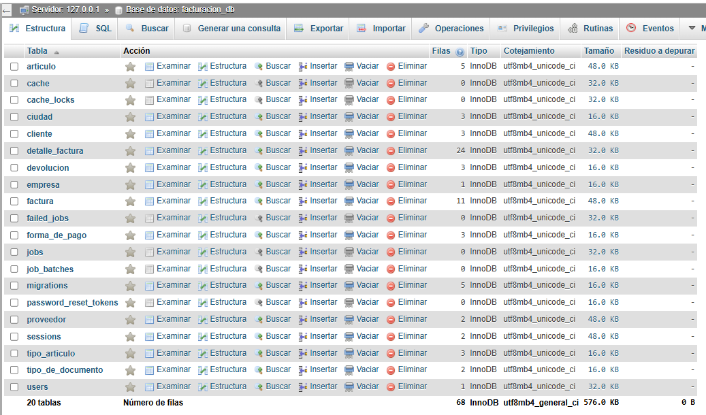

<!-- INSERTAR CAPTURA: vista Diseñador de phpMyAdmin (o MySQL Workbench) con las relaciones, incluida devolucion -> detalle_factura -->
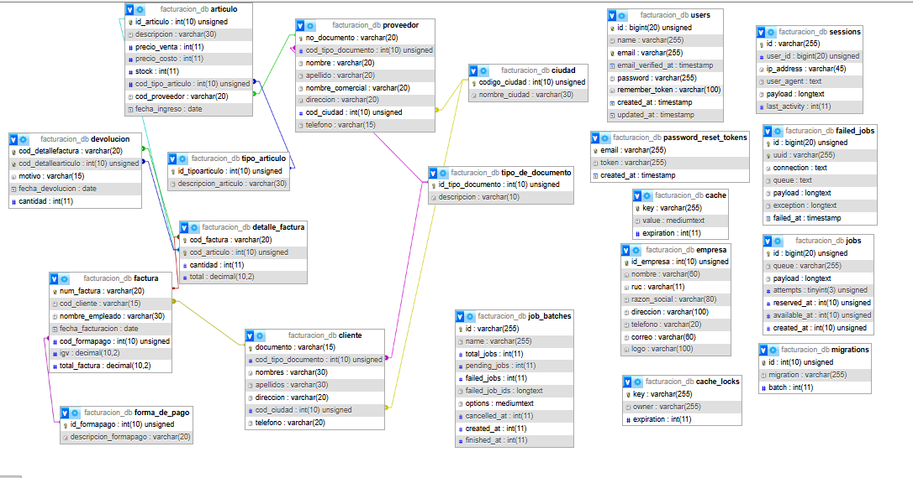

<!-- INSERTAR CAPTURA: terminal con php artisan migrate y php artisan db:seed --class=DemoSeeder -->
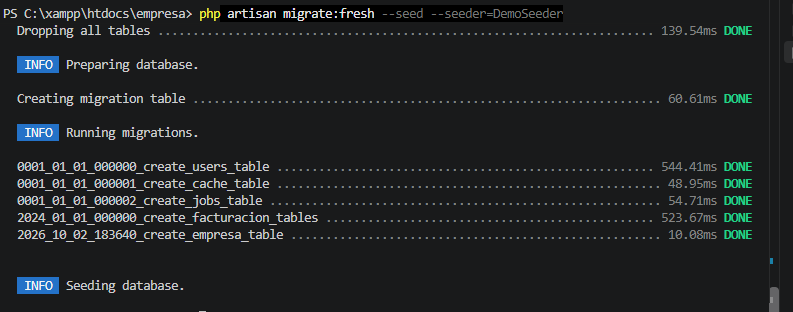

*Se usó `php artisan migrate:fresh --seed --seeder=DemoSeeder`, que recrea las tablas y carga los datos de demostración en un solo paso.*

### 8.2 Pantalla de inicio (invitado)
Pantalla que ve cualquier visitante sin sesión iniciada: describe el sistema y ofrece los botones para ingresar o registrarse. No muestra información del negocio.

<!-- INSERTAR CAPTURA: tarjeta de bienvenida con botones Ingresar y Registrarse -->
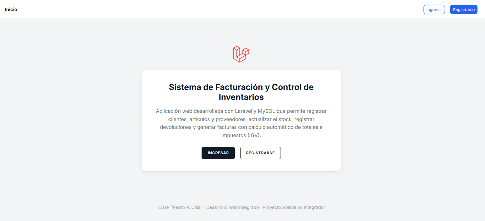

### 8.3 Login y registro
Formularios de acceso. El registro crea un usuario nuevo y el login da acceso al panel y a los módulos protegidos.

<!-- INSERTAR CAPTURA: formulario de login y formulario de registro -->
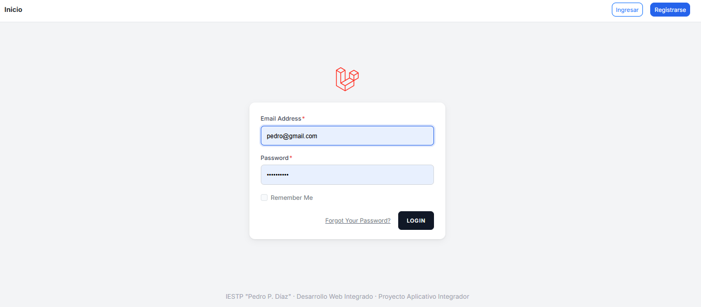
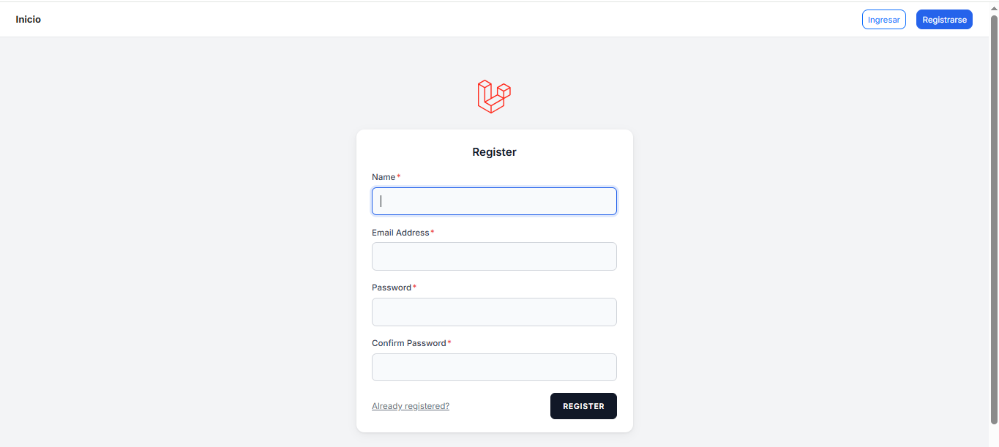

### 8.4 Datos de la empresa
Primer paso al usar el sistema: registrar el nombre, el RUC, la razón social, el domicilio fiscal, el contacto y el logo de la empresa. Estos datos se imprimen en cada comprobante.

<!-- INSERTAR CAPTURA: formulario Empresa con los datos completos y el logo cargado -->
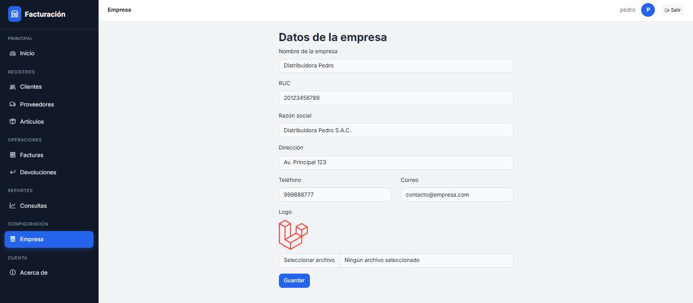

<!-- INSERTAR CAPTURA: mensaje "Datos de la empresa guardados" -->
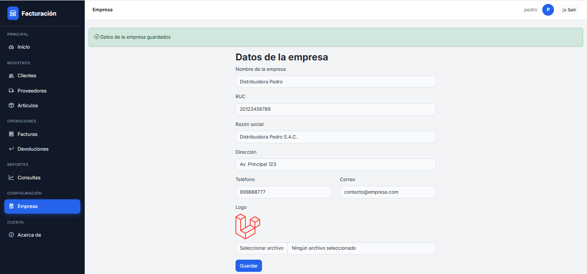

### 8.5 Panel de control (dashboard)
Resumen del negocio al iniciar sesión: indicadores generales, gráficos de ventas, artículos más vendidos y stock por tipo, y las últimas facturas.

<!-- INSERTAR CAPTURA: dashboard con tarjetas, gráficos y últimas facturas -->
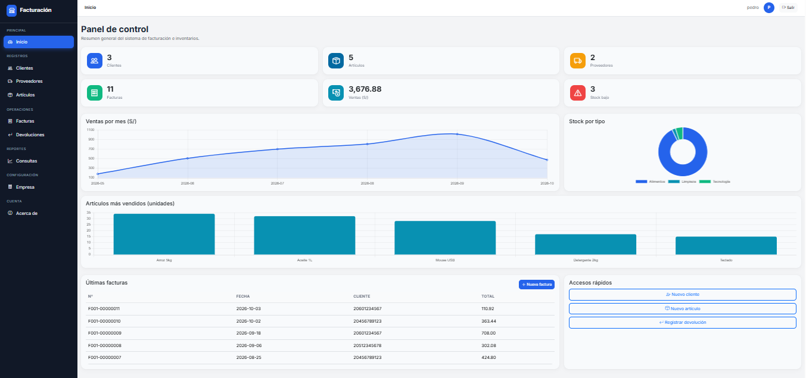

### 8.6 Menú lateral y versión móvil
En pantallas pequeñas el menú lateral se convierte en un panel desplegable (`offcanvas`) que se abre con el botón ☰, demostrando el diseño responsive de Bootstrap. En escritorio el mismo menú queda fijo a la izquierda.

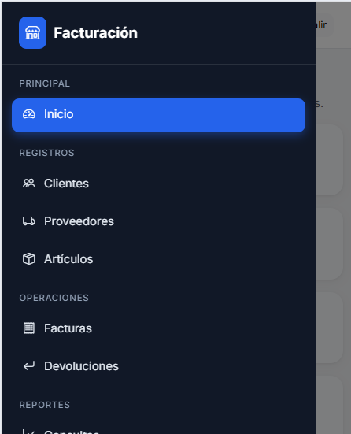

### 8.7 Página "Acerca de"
Página informativa del proyecto que solicita el laboratorio, construida sobre el mismo layout.

<!-- INSERTAR CAPTURA: página about -->
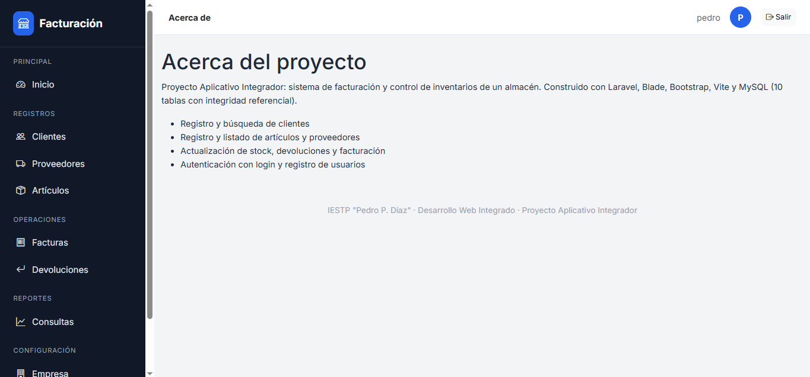

### 8.8 Clientes, artículos y proveedores
Listado con buscador y formulario de registro del CRUD genérico. Se muestra con uno de los tres módulos porque los tres funcionan igual. En artículos se muestra además el campo para sumar unidades al stock.

<!-- INSERTAR CAPTURA: listado de clientes con buscador y formulario de nuevo registro -->
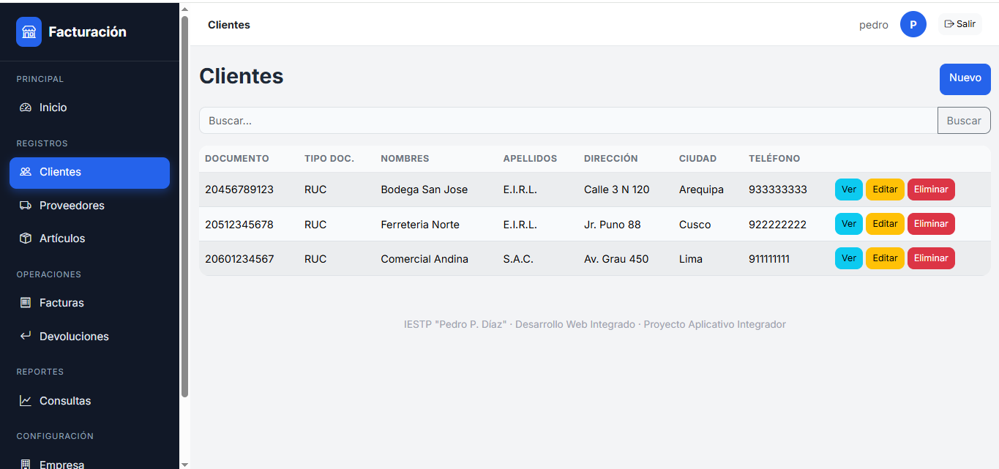
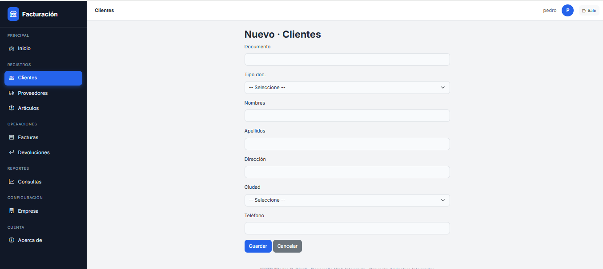

<!-- INSERTAR CAPTURA: listado de artículos con el campo +stock y el mensaje "Stock actualizado" -->
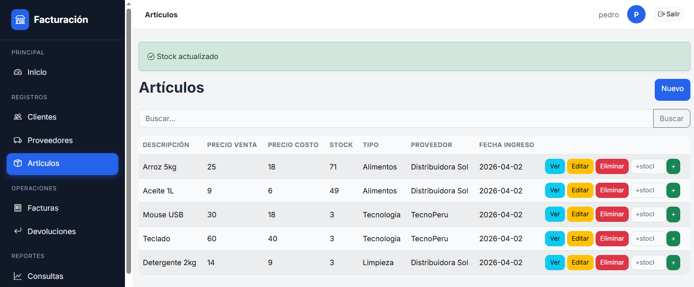
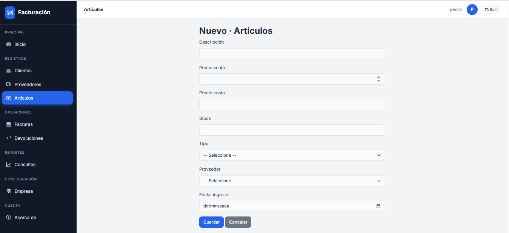

<!-- INSERTAR CAPTURA: listado y formulario de proveedores -->
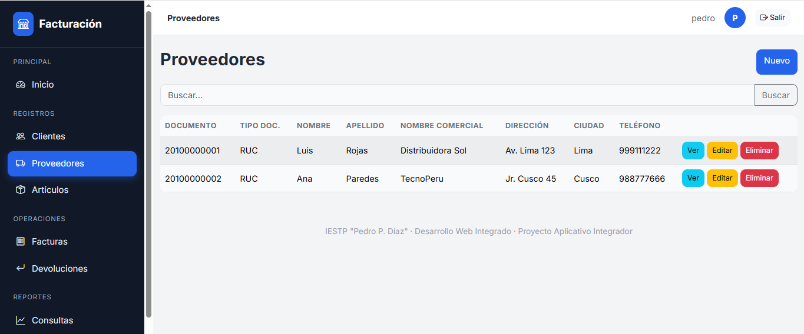
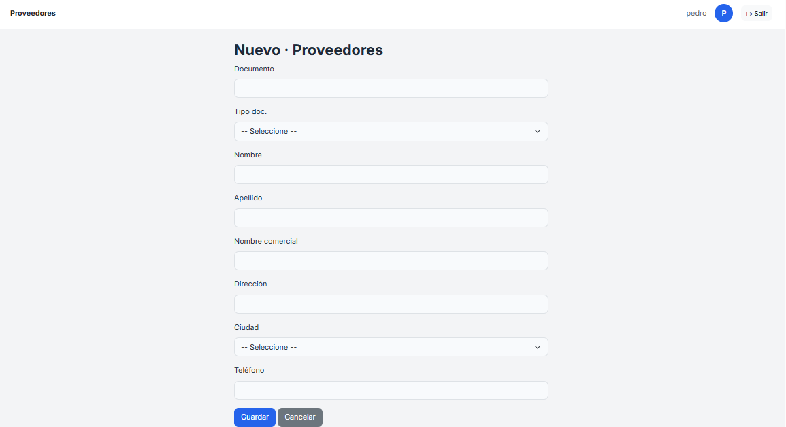

### 8.9 Realizar venta
Proceso de venta: selección de cliente y forma de pago, y artículos con el cálculo automático del subtotal, el IGV (18 %) y el total antes de facturar. Si la cantidad pedida supera el stock disponible, el sistema regresa al formulario con un mensaje y no registra la venta.

<!-- INSERTAR CAPTURA: pantalla Realizar venta con varios artículos y los totales -->
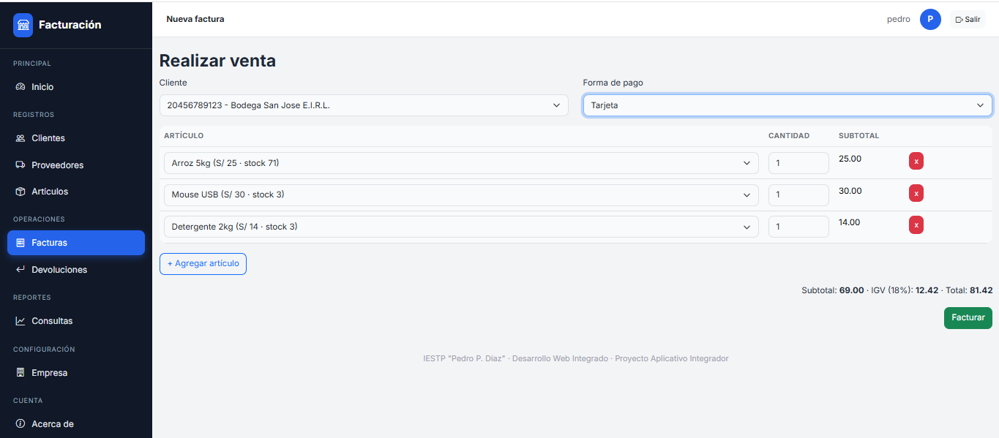

<!-- INSERTAR CAPTURA: mensaje de stock insuficiente en el formulario de venta -->
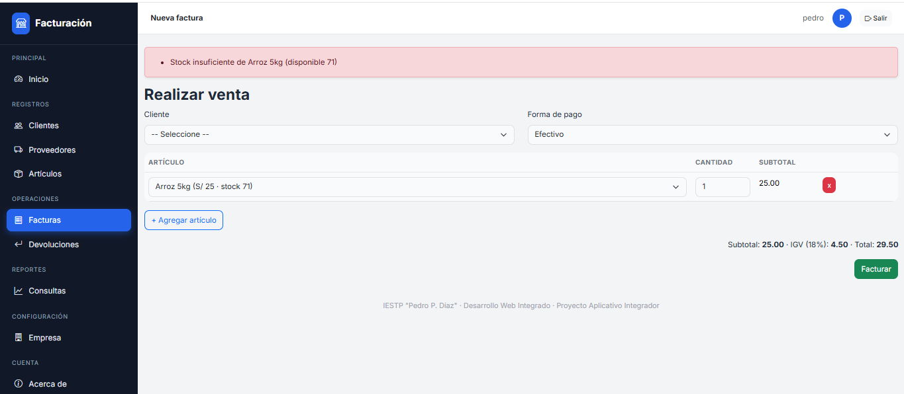

### 8.10 Factura
Al facturar se muestra la factura con el formato impreso de SUNAT: datos de la empresa y logo, recuadro con RUC y serie-correlativo (`F001-00000001`), datos del cliente, detalle, importe en letras, totales, código QR y hash. El botón **Imprimir** deja solo la factura en la hoja, y desde el cuadro de impresión se puede guardar como PDF. Desde esta misma pantalla, el botón **Devolver artículos** abre el formulario de devolución de la factura.

<!-- INSERTAR CAPTURA: factura con encabezado, detalle, totales, QR y hash -->
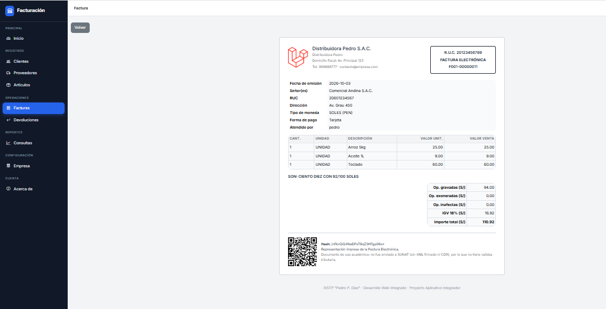

<!-- INSERTAR CAPTURA: vista previa de impresión / PDF de la factura, sin menú lateral -->
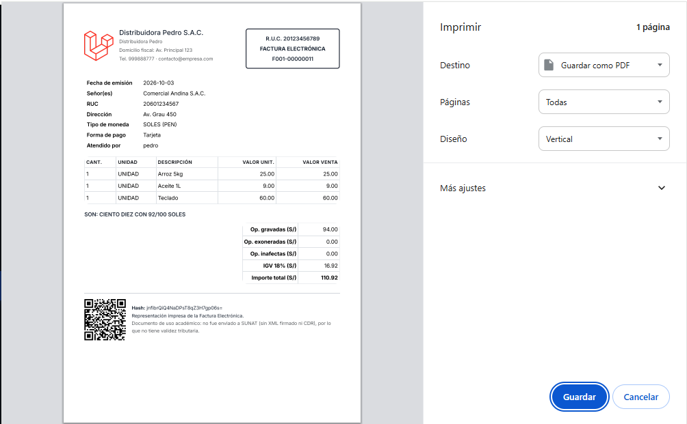

<!-- INSERTAR CAPTURA: listado de facturas emitidas -->
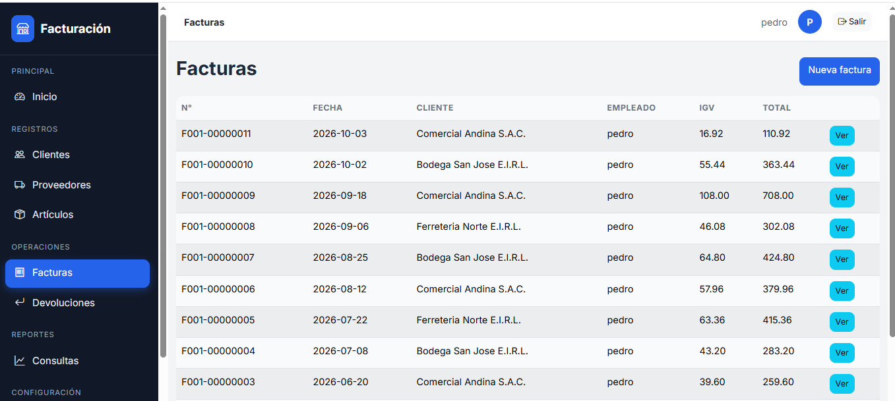

### 8.11 Devoluciones y consultas
La devolución se registra en tres pasos: elegir la factura de la lista, indicar las unidades de cada artículo y elegir el motivo. Si la factura elegida ya tuvo devoluciones, solo se muestra un aviso para elegir otra. Al guardar, el stock se repone y se abre el detalle de la devolución. El listado muestra una fila por factura con su fecha y el botón **Ver detalle**. Los reportes muestran los artículos con stock bajo y las ventas por cliente.

<!-- INSERTAR CAPTURA: formulario de devolución con una factura elegida y sus artículos -->
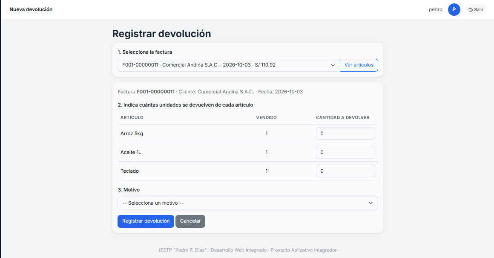

<!-- INSERTAR CAPTURA: aviso "Esta factura ya tuvo devoluciones" -->
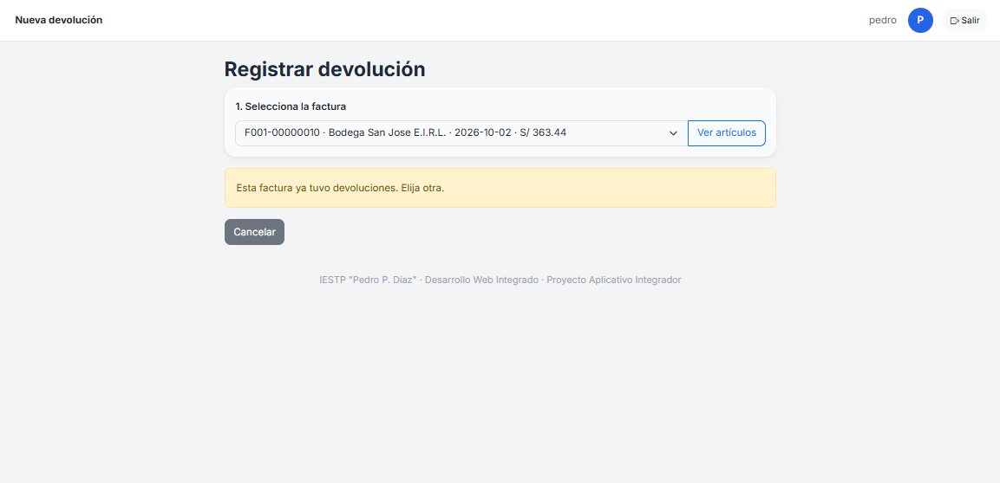

<!-- INSERTAR CAPTURA: listado de devoluciones (N° factura, fecha, Ver detalle) -->
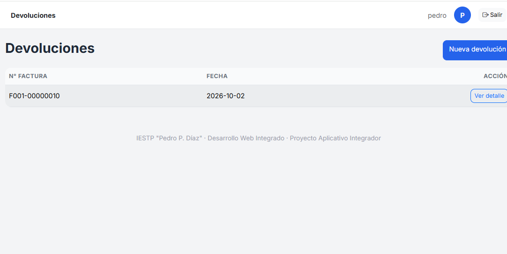

<!-- INSERTAR CAPTURA: detalle de una devolución con sus artículos -->
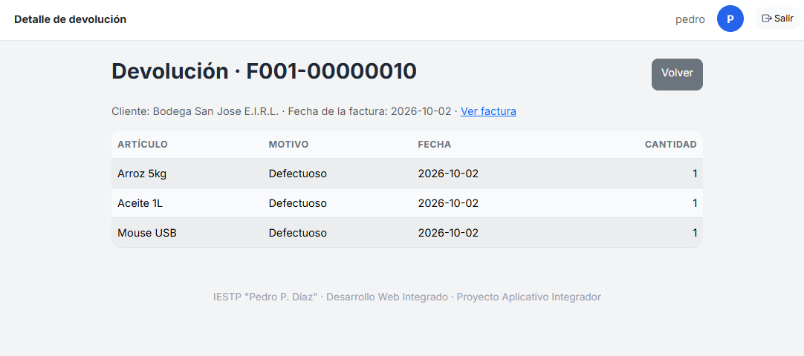

<!-- INSERTAR CAPTURA: pantalla de consultas -->
El documento del proyecto solicita "Consultas" sin especificar su contenido; se implementaron dos reportes útiles para el negocio: los artículos con stock bajo (para decidir reposiciones) y las ventas por cliente.

<!-- INSERTAR CAPTURA: pantalla de consultas -->
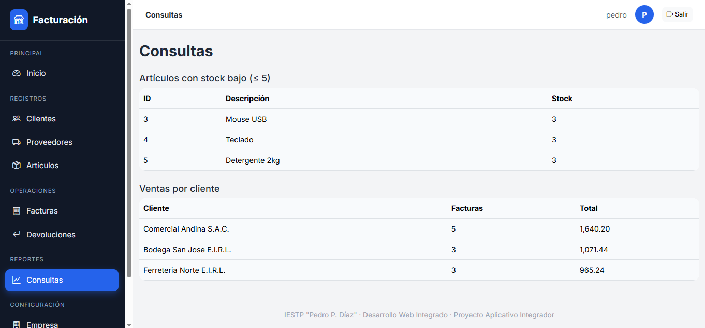

### 8.12 Terminal y estructura del proyecto
Evidencia de que el proyecto se ejecuta correctamente (`npm run dev` para compilar el frontend y `php artisan serve` para el servidor) y de la organización de carpetas del proyecto.

<!-- INSERTAR CAPTURA: terminal con npm run dev y php artisan serve; árbol de archivos en VS Code -->
<!-- INSERTAR CAPTURA: terminal con npm run dev y php artisan serve; árbol de archivos en VS Code -->
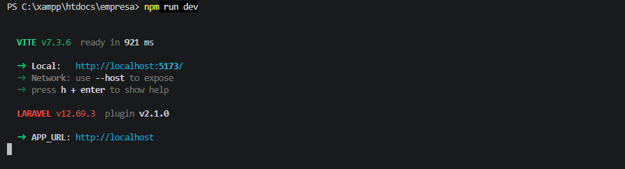
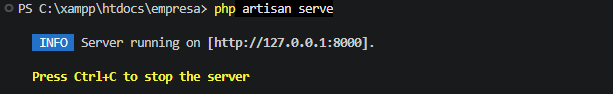
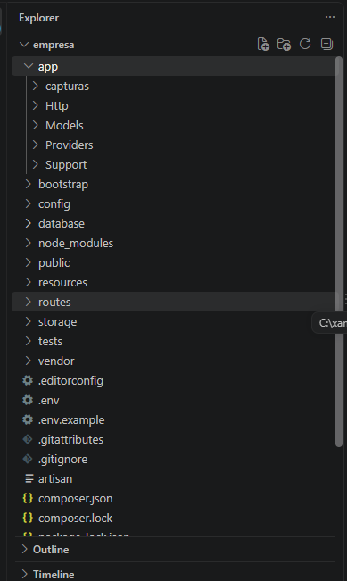

---

## 9. Cumplimiento del proyecto integrador

### 9.1 Requerimientos del proyecto

El documento del Proyecto Aplicativo Integrador pide un sistema de facturación y control de inventarios desarrollado en Laravel y MySQL con XAMPP. La siguiente tabla relaciona cada requerimiento con su implementación en este laboratorio.

| Requerimiento del proyecto | Implementación | Sección |
|---|---|---|
| Base de datos MySQL relacional de 10 tablas con integridad referencial | Migración con las 10 tablas del diagrama y llaves foráneas, incluida la de `devolucion` | 7.3 |
| Datos de la empresa que factura | Tabla `empresa`, modelo, controlador y formulario con logo | 7.3, 7.7, 7.15 |
| Registro de clientes | `ClienteController` sobre `CrudController` | 7.5, 7.6 |
| Búsqueda de clientes | Buscador `LIKE` del listado genérico | 7.5, 7.14 |
| Registro y lista de artículos | `ArticuloController` y vistas genéricas | 7.6, 7.14 |
| Registro y lista de proveedores | `ProveedorController` y vistas genéricas | 7.6, 7.14 |
| Actualizar stock de artículos | Método `stock()` que suma unidades al inventario | 7.6 |
| Realizar venta (facturar) con totales e impuestos automáticos | `FacturaController`: IGV 18 %, total, serie y correlativo, descuento de stock en transacción | 7.8, 7.16 |
| Devoluciones | `DevolucionController`: listado por factura, detalle, aviso si la factura ya tuvo devoluciones, validación de lo vendido y reposición de stock | 7.8, 7.17 |
| Consultas | `ConsultaController`: stock bajo y ventas por cliente | 7.9, 7.13 |
| Desarrollo en Laravel con MySQL sobre XAMPP | Laravel 12, MySQL de XAMPP y servidor local | 5, 7.1 |

### 9.2 Alcance del comprobante de venta

La factura reproduce el formato impreso de una factura electrónica peruana. La siguiente tabla indica qué elementos están implementados y cuáles quedan fuera del alcance del laboratorio.

| Elemento del comprobante | En este proyecto |
|---|---|
| Datos del emisor: RUC, razón social, domicilio fiscal y logo | Implementado (tabla `empresa`) |
| Tipo de comprobante, serie y correlativo | Implementado (`F001-00000001`) |
| Datos del adquirente: tipo y número de documento, nombre y dirección | Implementado |
| Fecha de emisión, moneda y forma de pago | Implementado |
| Detalle con cantidad, unidad, descripción y valor unitario | Implementado |
| Operaciones gravadas, exoneradas e inafectas, IGV 18 % e importe total | Implementado |
| Importe total en letras | Implementado (`NumeroALetras`) |
| Código QR con el orden de datos de SUNAT | Implementado |
| Hash | Simulado: resumen SHA-1 del texto del QR |
| XML firmado (UBL 2.1), envío a SUNAT y constancia de recepción (CDR) | No incluido |

Los elementos no incluidos requieren un certificado digital y la comunicación con SUNAT a través de un Operador de Servicios Electrónicos (OSE) o un Proveedor de Servicios Electrónicos (PSE). Por ese motivo la factura lleva la leyenda *"Documento de uso académico: no fue enviado a SUNAT, por lo que no tiene validez tributaria"*, y la integración con un OSE/PSE se plantea como la siguiente etapa del sistema.

---

## 10. Conclusiones

- Vite con `laravel-vite-plugin` y la directiva `@vite` centraliza la carga de CSS y JS, y Sass permitió importar Bootstrap completo desde un solo punto de entrada (`app.scss`).
- Un único layout con `@yield('content')`, `@include` y `@stack('scripts')` evitó duplicar la estructura HTML y permitió que cada vista cargara solo los scripts que necesita.
- Un controlador base abstracto (`CrudController`) con vistas genéricas permitió construir tres módulos (clientes, proveedores y artículos) definiendo solo sus campos.
- Las transacciones (`DB::transaction`) con bloqueo de filas garantizan que la facturación y las devoluciones mantengan el inventario consistente, y la llave foránea compuesta de `devolucion` asegura que solo se devuelva lo que se vendió.
- La tabla `empresa` hizo posible que cada comprobante muestre los datos y el logo del emisor, y la numeración por serie y correlativo, junto con el QR y el importe en letras, acerca el documento al formato real de una factura.
- El seeder permite reproducir el sistema con datos coherentes en cualquier equipo, lo que facilita las pruebas y la revisión.
- Un tema propio sobre Bootstrap resultó suficiente para obtener un panel profesional sin depender de una plantilla externa.
- Mostrar el dashboard solo a usuarios autenticados (`@auth` / `@guest` y `middleware('auth')`) protege la información del negocio.
- Como siguiente etapa, el sistema puede conectarse a un OSE/PSE para emitir comprobantes electrónicos con validez tributaria.

---

## 11. Repositorio

Código fuente completo disponible en este repositorio de GitHub
